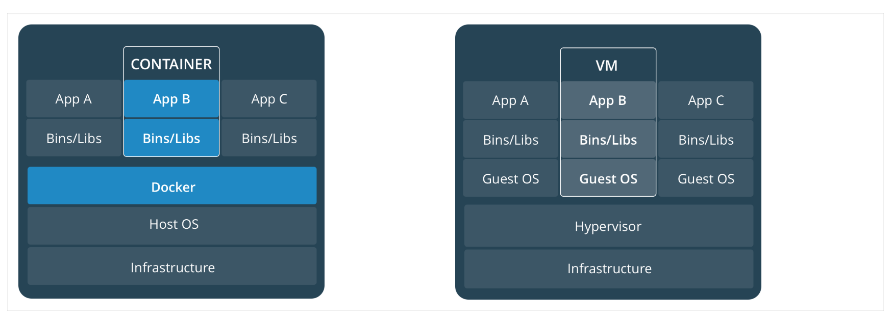

## 简介

> 你需要了解的 Docker

> 在了解学习 Docker 之前我们就非常有必要介绍下 Docker 的前生 LXC（Linux Container）。

> 

### LXC 介绍¶

> LXC 可以提供轻量级的虚拟化，用来隔离进程和资源，和我们传统观念中的全虚拟化完全不一样，非常轻量级。LXC 可以将单个操作系统管理的资源划分到独立的组中，和传统的虚拟化技术相比，LXC 有如下一些优势：

*   和宿主机使用同一个内核，所以性能损耗小
*   不需要指令级模拟
*   不需要即时编译
*   容器可以在 CPU 核心的本地运行指令，不需要任何专门的解释机制
*   避免了虚拟化和系统调用中的复杂性
*   轻量级隔离，隔离的同时还可以和宿主机共享资源

> LXC 有点像 chroot，提供了一个拥有自己进程和网络空间的虚拟环境，但是和虚拟机又不一样，因为 LXC 是一种操作系统层面上的资源的虚拟化。

> chroot 简介

> chroot（change root），在 Linux 系统中，系统默认的目录就都是以 `/` 也就是根目录开头的，chroot 的使用能够改变当前的系统根目录结构，通过改变当前系统的根目录，我们能够限制用户的权利，在新的根目录下并不能够访问旧系统根目录的结构个文件，也就建立了一个与原系统完全隔离的目录结构。

> 更多关于 chroot 的介绍，可以查看 理解 chroot 一文。

### 什么是 Docker¶

> Docker 并不是 LXC 替代品，Docker 底层就是使用的 LXC 来实现，LXC 将 Linux 进程沙盒化，使得进程之间相互隔离，还可以共享宿主机的资源。在 LXC 的基础上，Docker 提供了一系列更加强大方便的功能，使得 Docker 成为了现在最火的虚拟化技术。

> 由于之前我们的后台在开发和运维阶段的环境是不一致的，这就导致了 Docker 的出现，因为我们通过 Docker 可以将程序运行的环境也一起打包到版本控制去了，这样就排除了因为环境不同造成的各种麻烦事情了，也不会出现在本地可以在线上却不行这样的窘境了。

> Docker 是一个开源的应用容器引擎，基于 go 语言开发，可以让开发者打包他们的应用以及依赖包到一个轻量级、可移植的容器中，然后发布到任何流行的 Linux 服务器。容器是一个沙箱机制，相互之间不会有影响（类似于我们手机上运行的 app），并且容器开销是很低的。

> 用官方的话来说，Docker 受欢迎，是因为以下几个特点：

*   灵活性：即使是最复杂的应用也可以集装箱化
*   轻量级：容器利用并共享主机内核
*   可互换：您可以即时部署更新和升级
*   便携式：您可以在本地构建，部署到云，并在任何地方运行
*   可扩展：您可以增加并自动分发容器副本
*   可堆叠：您可以垂直和即时堆叠服务

### Docker 几个重要概念¶

> 在了解了 Docker 是什么之后，我们需要先了解下 Docker 中最重要的3个概念：镜像、容器和仓库。

> `镜像` 是一个只读模板，带有创建 Docker 容器的说明，一般来说的，镜像会基于另外的一些基础镜像并加上一些额外的自定义功能来组成。比如，你可以构建一个基于 Centos 的镜像，然后在这个基础镜像上面安装一个 Nginx 服务器，这样就可以构成一个属于我们自己的镜像了。

> `容器` 是一个镜像的可运行的实例，可以使用 Docker REST API 或者 CLI 命令行工具来操作容器，容器的本质是进程，但与直接在宿主执行的进程不同，容器进程运行于属于自己的独立的命名空间。因此容器可以拥有自己的 root 文件系统、自己的网络配置、自己的进程空间，甚至自己的用户 ID 空间。容器内的进程是运行在一个隔离的环境里，使用起来，就好像是在一个独立于宿主的系统下操作一样。这种特性使得容器封装的应用比直接在宿主运行更加安全。

> `registry` 是用来存储 Docker 镜像的仓库，Docker Hub 是 Docker 官方提供的一个公共仓库，而且 Docker 默认也是从 Docker Hub 上查找镜像的，当然你也可以很方便的运行一个私有仓库，当我们使用 `docker pull` 或者 `docker run` 命令时，就会从我们配置的 Docker 镜像仓库中去拉取镜像，使用 `docker push` 命令时，会将我们构建的镜像推送到对应的镜像仓库中，registry 可以理解为用于镜像的 github 这样的托管服务。

### 容器和虚拟机¶

> 上面我们说到了容器是在 Linux 上本机运行，并与其他容器共享主机的内核，它运行一个独立的进程，不占用其他任何可执行文件的内存，非常轻量。

> 而虚拟机运行的是一个完整的操作系统，通过虚拟机管理程序对主机资源进行虚拟访问，相比之下需要的资源需要更多，但是非常安全，因为是独立的操作系统，独立的内核。

> 

### 支持 Docker 的底层技术¶

> `Docker 本质就是宿主机的一个特殊进程`，Docker 是通过 `namespace` 实现资源隔离，通过`cgroup` 实现资源限制，通过写时复制技术（copy-on-write）实现了高效的文件操作（类似虚拟机的磁盘比如分配 500g 并不是实际占用物理磁盘 500g）

#### Namespaces¶

> 命名空间 (namespaces) 是 Linux 为我们提供的用于分离进程树、网络接口、挂载点以及进程间通信等资源的方法。在日常使用个人 PC 时，我们并没有运行多个完全分离的服务器的需求，但是如果我们在服务器上启动了多个服务，这些服务其实会相互影响的，每一个服务都能看到其他服务的进程，也可以访问宿主机器上的任意文件，一旦服务器上的某一个服务被入侵，那么入侵者就能够访问当前机器上的所有服务和文件，这是我们不愿意看到的，我们更希望运行在同一台机器上的不同服务能做到完全隔离，就像运行在多台不同的机器上一样。而 Docker 其实就通过 Linux 的 Namespaces 技术来实现的对不同的容器进行隔离。

> 当我们运行（docker run 或者 docker start）一个 Docker 容器时，Docker 会为该容器设置一系列的 namespaces，这些 namespaces 提供了一层隔离，容器的各个方面都在单独的 namespace 中运行，并且对其的访问仅限于该 namespace。

> Docker 在 Linux 上使用以下几个命名空间（上面说的各个方面）：

*   pid namespace：用于进程隔离（PID：进程ID）
*   net namespace：管理网络接口（NET：网络）
*   ipc namespace：管理对 IPC 资源的访问（IPC：进程间通信（信号量、消息队列和共享内存））
*   mnt namespace：管理文件系统挂载点（MNT：挂载）
*   uts namespace：隔离主机名和域名
*   user namespace：隔离用户和用户组（3.8以后的内核才支持）

#### CGroups¶

> 我们通过 Linux 的 namespaces 技术为新创建的进程隔离了文件系统、网络、进程等资源，但是 namespaces 并不能够为我们提供物理资源上的隔离，比如 CPU、内存、IO 或者网络带宽等，所以如果我们运行多个容器的话，则容器之间就会抢占资源互相影响了，所以对容器资源的使用进行限制就非常重要了，而 Control Groups（CGroups）技术就能够隔离宿主机上的物理资源。CGroups 由 7 个主要的子系统组成：分别是 cpuset、cpu、cpuacct、blkio、devices、freezer、memory，不同类型资源的分配和管理是由各个 CGroup 子系统负责完成的。

> CGroup 简介

> 在 CGroup 中，所有的任务就是一个系统的一个进程，而 CGroup 就是一组按照某种标准划分的进程，在 CGroup 这种机制中，所有的资源控制都是以 CGroup 作为单位实现的，每一个进程都可以随时加入一个 CGroup 也可以随时退出一个 CGroup。

> – CGroup 介绍、应用实例及原理描述

> – Docker 背后的内核 Cgroups 机制

> CGroup 具有以下几个特点：

*   CGroup 的 API 以一个伪文件系统（/sys/fs/cgroup/）的实现方式，用户的程序可以通过文件系统实现 CGroup 的组件管理
*   CGroup 的组件管理操作单元可以细粒度到线程级别，用户可以创建和销毁 CGroup，从而实现资源载分配和再利用
*   所有资源管理的功能都以子系统（cpu、cpuset 这些）的方式实现，接口统一子任务创建之初与其父任务处于同一个 CGroup 的控制组

> 另外 CGroup 具有四大功能：

*   资源限制：可以对任务使用的资源总额进行限制
*   优先级分配：通过分配的 cpu 时间片数量以及磁盘 IO 带宽大小等，实际上相当于控制了任务运行优先级
*   资源统计：可以统计系统的资源使用量，如 cpu 时长，内存用量等
*   任务控制：cgroup 可以对任务执行挂起、恢复等操作

#### UnionFS¶

> Linux 的命名空间和控制组分别解决了不同资源隔离的问题，前者解决了进程、网络以及文件系统的隔离，后者实现了 CPU、内存等资源的隔离，但是在 Docker 中还有另一个非常重要的问题需要解决 - 也就是镜像。

> 镜像到底是什么，它又是如何组成和组织的呢？而这其中最重要的概念就是镜像层(Layers)（如下图）的概念，而镜像层依赖于一系列的底层技术，比如文件系统(filesystems)、写时复制(copy-on-write)、联合挂载(union mounts)等。

> 

> Docker 镜像是由一系列的层组成的，每层代表 Dockerfile 中的一条指令，比如下面的 Dockerfile 文件：

```
FROM ubuntu:04
COPY . /app
RUN make /app
CMD python /app/app.py
```

> Dockerfile 介绍

> `Dockerfile` 是一个文本文件，其内包含了一条条的指令，每一条指令构建一层，因此每一条指令的内容，就是描述该层应当如何构建。Dockerfile 是我们用来构建 Docker 镜像的一个说明文档，也是我们学习的重点，必须要要掌握如何编写 Dockerfile。

> 这里的 Dockerfile 包含4条命令，其中每一行就创建了一层，`FROM` 语句从 `ubuntu:18.04` 这个基础镜像创建一个层开始，`COPY` 命令从 Docker 客户端的当前目录添加一些新的文件，`RUN` 指令使用 make 命令构建应用，最后一层指定在容器中运行什么命令。

> 镜像就是由这些层一层一层堆叠起来的，镜像中的这些层都是只读的，当我们运行容器的时候，就可以在这些基础层之上添加新的可写层，也就是我们通常说的`容器层`，对于运行中的容器所做的所有更改（比如写入新文件、修改现有文件、删除文件）都将写入这个容器层，下面显示了基于 Ubuntu 15.04 镜像运行的容器层的结构：

> 

> 容器和镜像之间的主要区别就是容器在镜像顶部由一个可写层，在容器中的所有操作都会存储在这个容器层中，删除容器后，容器层也会被删除，但是镜像不会变化。正因为每个容器都有自己的可写容器层，所有更改都存储在自己的容器层中，所以多个容器之间可以共享同一基础镜像的访问，但仍然具有自己的数据状态。如下图演示了多个容器共享同一镜像的请情况：

> 

> Docker 使用存储驱动程序来管理镜像层和可写容器层的内容，每个存储驱动程序的处理方式不同，但是所有的驱动都使用可堆叠的镜像层和写时复制（Cow）策略，这些驱动程序管理的这些层其实就是 UnionFS（联合文件系统），现在 Docker 主要支持的存储驱动有 aufs、devicemapper、overlay、overlay2、zfs 和 vfs 等等，在新的 Docker 版本中，overlay2 取代了 aufs 成为了推荐的存储驱动。

> Copy-on-write

> 写时复制是一种共享和复制文件的策略，可以最大程度地提高效率，如果文件或目录位于镜像的较低层中，而另一层（包括可写层）需要对其进行读取访问，则它直接使用现有文件即可。另一层第一次需要修改文件时（在构建镜像或运行容器时），将文件复制到该层并进行修改。这样可以将 I/O 和每个后续层的大小最小化。

> 选择存储驱动

> 对于 Docker 如何选择一个合适的存储驱动程序，可以查看官方文档 Docker storage drivers。

### Docker 架构¶

> Docker 使用 C/S （客户端/服务器）体系的架构，Docker 客户端与 Docker 守护进程（Dockerd）通信，Docker 守护进程负责构建，运行和分发 Docker 容器。Docker 客户端和守护进程可以在同一个系统上运行，也可以将 Docker 客户端连接到远程 Docker 守护进程。Docker 客户端和守护进程使用 REST API 通过 UNIX 套接字或网络接口进行通信。

> 