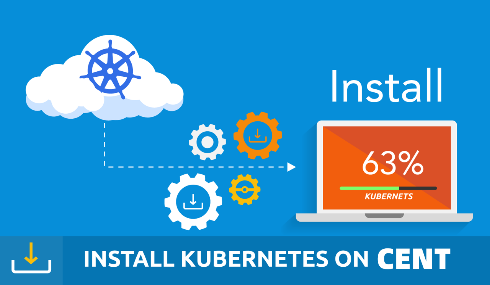
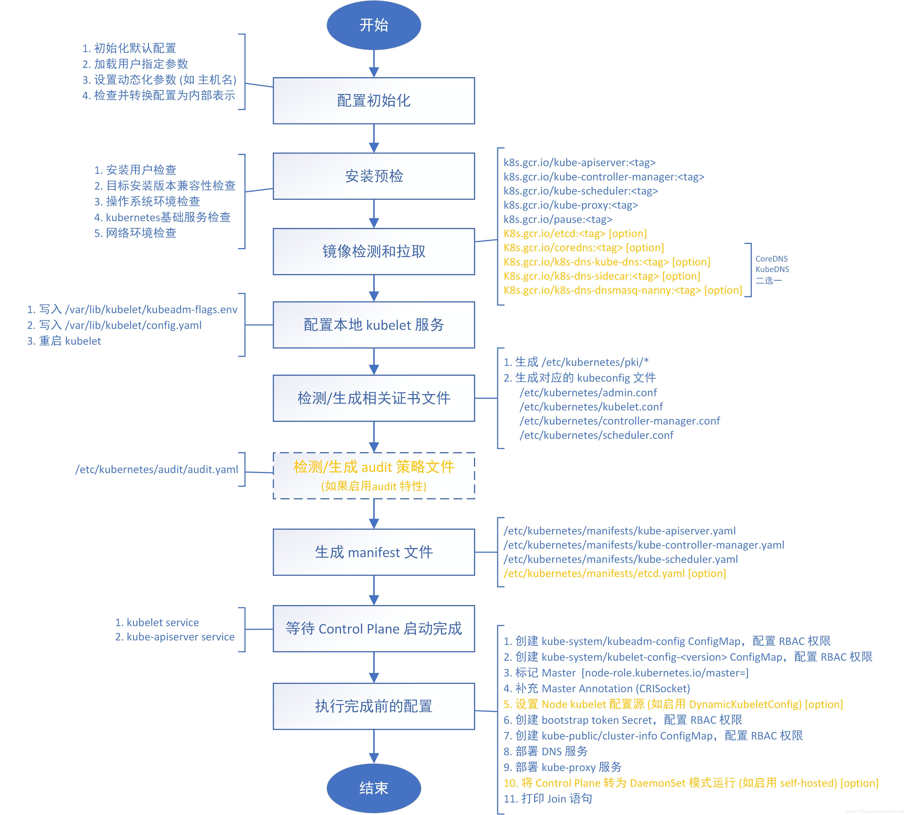
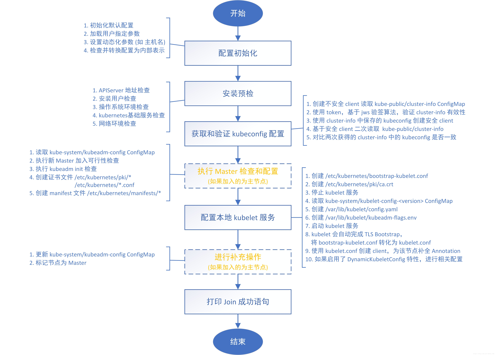
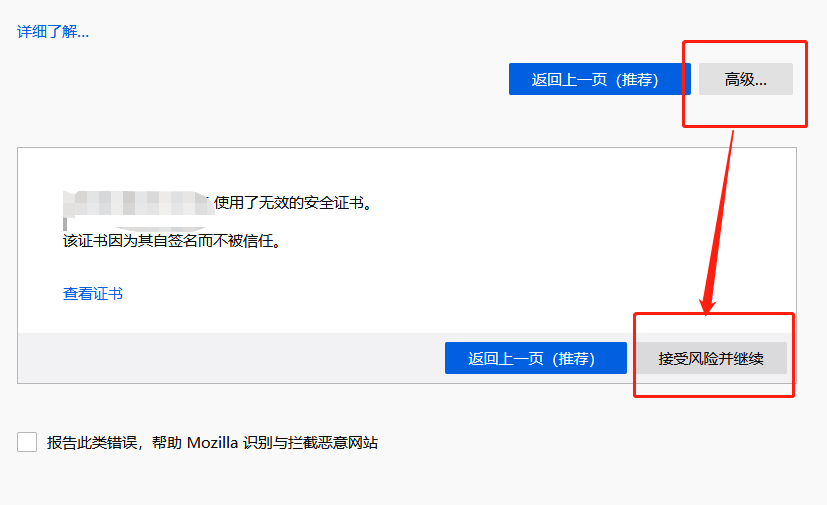

## 安装

> Kubernetes 集群环境安装

> 为了根据最新的集群特性，我们这里安装目前最新的版本 v1.16.2，如果你是在生产环境使用，建议使用上一个版本中最大的修正版本，比如 v1.15.5，由于 v1.16 版本和之前的版本有很大变化，主要体现在 APIVersion 移除了之前的一些版本，所以我们这里采用最新的 v1.16.2 的版本。由于我们这里主要目的也是学习 Kubernetes 的一些知识点，所以采用的是 Kubeadm 来快速搭建单 Master 的集群，在后面如有需要我们可以在学习了这些知识点后来搭建适合生产环境使用的集群。

> 

### 环境准备 

> 3个节点，都是 Centos 7.6 系统，内核版本：3.10.0-957.12.2.el7.x86_64，在每个节点上添加 hosts 信息：

```
$ cat /etc/hosts
111 ydzs-master
122 ydzs-node1
123 ydzs-node2
```

> hostname

> 节点的 hostname 必须使用标准的 DNS 命名，另外千万不用什么默认的 `localhost` 的 hostname，会导致各种错误出现的。在 Kubernetes 项目里，机器的名字以及一切存储在 Etcd 中的 API 对象，都必须使用标准的 DNS 命名（RFC 1123）。可以使用命令 

```
hostnamectl set-hostname ydzs-node1
```

 来修改 hostname。

> 禁用防火墙：

```
$ systemctl stop firewalld
$ systemctl disable firewalld
```

> 禁用SELINUX：

```
$ setenforce 0
$ cat /etc/selinux/config
SELINUX=disabled
```

> 由于开启内核 ipv4 转发需要加载 br_netfilter 模块，所以加载下该模块：

```
$ modprobe br_netfilter
```

> 创建

```
/etc/sysctl.d/k8s.conf
```

文件，添加如下内容：

```
net.bridge.bridge-nf-call-ip6tables = 1
net.bridge.bridge-nf-call-iptables = 1
net.ipvip_forward = 1
```

> bridge-nf

> bridge-nf 使得 netfilter 可以对 Linux 网桥上的 IPv4/ARP/IPv6 包过滤。比如，设置

```
net.bridge.bridge-nf-call-iptables＝1
```

后，二层的网桥在转发包时也会被 iptables的 FORWARD 规则所过滤。常用的选项包括：

*   net.bridge.bridge-nf-call-arptables：是否在 arptables 的 FORWARD 中过滤网桥的 ARP 包
*   net.bridge.bridge-nf-call-ip6tables：是否在 ip6tables 链中过滤 IPv6 包
*   net.bridge.bridge-nf-call-iptables：是否在 iptables 链中过滤 IPv4 包
*   net.bridge.bridge-nf-filter-vlan-tagged：是否在 iptables/arptables 中过滤打了 vlan 标签的包。

> 执行如下命令使修改生效：

```
$ sysctl -p /etc/sysctl.d/k8s.conf
```

> 安装 ipvs：

```
$ cat > /etc/sysconfig/modules/ipvs.modules <<EOF
#!/bin/bash
modprobe -- ip_vs
modprobe -- ip_vs_rr
modprobe -- ip_vs_wrr
modprobe -- ip_vs_sh
modprobe -- nf_conntrack_ipv4
EOF
$ chmod 755 /etc/sysconfig/modules/ipvs.modules && bash /etc/sysconfig/modules/ipvs.modules && lsmod | grep -e ip_vs -e nf_conntrack_ipv4
```

> 上面脚本创建了的

```
/etc/sysconfig/modules/ipvs.modules
```

文件，保证在节点重启后能自动加载所需模块。使用

```
lsmod | grep -e ip_vs -e nf_conntrack_ipv4
```

命令查看是否已经正确加载所需的内核模块。

> 接下来还需要确保各个节点上已经安装了 ipset 软件包：

`$ yum install ipset`

> 为了便于查看 ipvs 的代理规则，最好安装一下管理工具 ipvsadm：

```
$ yum install ipvsadm
```

> 同步服务器时间

```
$ yum install chrony -y
$ systemctl enable chronyd
$ systemctl start chronyd
$ chronyc sources
210 Number of sources = 4
MS Name/IP address         Stratum Poll Reach LastRx Last sample

^+ svggsrv.de                  2   6    17    32   -823us[-1128us] +/-   98ms
^- montreal.ca.logiplex.net      2   6    17    32    -17ms[  -17ms] +/-  179ms
^- ntpflashdance.cx            2   6    17    32    -32ms[  -32ms] +/-  161ms
^* 11184                2   6    33    32   +661us[ +357us] +/-   38ms
$ date
Tue Aug 27 09:28:41 CST 2019
```

> 关闭 swap 分区：

`$ swapoff -a`

> 修改`/etc/fstab`文件，注释掉 SWAP 的自动挂载，使用`free -m`确认 swap 已经关闭。swappiness 参数调整，修改

```
/etc/sysctl.d/k8s.conf
```

添加下面一行：

`vm.swappiness=0`

> 执行

```
sysctl -p /etc/sysctl.d/k8s.conf
```

使修改生效。

> 接下来可以安装 Docker:

```
$ yum install -y yum-utils \\
  device-mapper-persistent-data \\
  lvm2
# 如果下面命令执行超时，可以使用阿里云的源代替：http://mirrors.aliyun.com/docker-ce/linux/centos/docker-ce.repo
$ yum-config-manager \\
    --add-repo \\
    https://download.docker.com/linux/centos/docker-ce.repo
$ yum list docker-ce --showduplicates | sort -r
 * updates: mirrors.tuna.tsinghua.edu.cn
Loading mirror speeds from cached hostfile
Loaded plugins: fastestmirror, langpacks
Installed Packages
 * extras: mirrors.tuna.tsinghua.edu.cn
 * epel: mirrors.yun-idc.com
docker-ce.x86_64            3:1-el7                     docker-ce-stable
docker-ce.x86_64            3:0-el7                     docker-ce-stable
docker-ce.x86_64            3:8-el7                     docker-ce-stable
......
docker-ce.x86_64            ce-elcentos             docker-ce-stable
docker-ce.x86_64            ce-elcentos             docker-ce-stable
......
 * base: mirror.lzu.edu.cn
Available Packages
```

> 可以选择安装一个版本，比如我们这里安装最新版本：

```
# 建议安装09版本，是最新验证的版本
$ yum install docker-ce-9
```

> 配置 Docker 镜像加速器:

```
$ mkdir -p /etc/docker  # 如果没有这个目录先创建，然后添加 daemon.json 文件
$ vi /etc/docker/daemon.json
{
  "exec-opts": ["native.cgroupdriver=systemd"],
  "registry-mirrors" : [
    "https://ot2k4dmirror.aliyuncs.com/"
  ]
}
```

> cgroup 驱动

> 由于默认情况下 kubelet 使用的 cgroupdriver 是 systemd，所以需要保持 docker 和kubelet 的 cgroupdriver 一致，我们这里修改 docker 的 cgroupdriver=systemd。如果不修改 docker 则需要修改 kubelet 的启动配置，需要保证两者一致。

> 启动 Docker：

```
$ systemctl start docker
$ systemctl enable docker
```

> 在确保 Docker 安装完成后，上面的相关环境配置也完成了，现在我们就可以来安装 Kubeadm 了，我们这里是通过指定yum 源的方式来进行安装的：

```
cat <<EOF > /etc/yum.repos.d/kubernetes.repo
[kubernetes]
name=Kubernetes
baseurl=https://packages.cloud.google.com/yum/repos/kubernetes-el7-x86_64
enabled=1
gpgcheck=1
repo_gpgcheck=1
gpgkey=https://packages.cloud.google.com/yum/doc/yum-key.gpg
        https://packages.cloud.google.com/yum/doc/rpm-package-key.gpg
EOF
```

> 当然了，上面的 yum 源是需要科学上网的，如果不能科学上网的话，我们可以使用阿里云的源进行安装：

```
cat <<EOF > /etc/yum.repos.d/kubernetes.repo
[kubernetes]
name=Kubernetes
baseurl=http://mirrors.aliyun.com/kubernetes/yum/repos/kubernetes-el7-x86_64
enabled=1
gpgcheck=0
repo_gpgcheck=0
gpgkey=http://mirrors.aliyun.com/kubernetes/yum/doc/yum-key.gpg
        http://mirrors.aliyun.com/kubernetes/yum/doc/rpm-package-key.gpg
EOF
```

> 然后安装 kubeadm、kubelet、kubectl：

```
# --disableexcludes 禁掉除了kubernetes之外的别的仓库
$ yum install -y kubelet-2 kubeadm-2 kubectl-2 --disableexcludes=kubernetes
$ kubeadm version
kubeadm version: &version.Info{Major:"1", Minor:"16", GitVersion:"v2", GitCommit:"c97fe5036ef3df2967d086711e6c0c405941e14b", GitTreeState:"clean", BuildDate:"2019-10-15T19:15:39Z", GoVersion:"go10", Compiler:"gc", Platform:"linux/amd64"}
```

> 可以看到我们这里安装的是 v1.16.2 版本，然后将 kubelet 设置成开机启动：

```
$ systemctl enable --now kubelet
```

> > 到这里为止上面所有的操作都需要在所有节点执行配置。

### 初始化集群 

> 然后接下来在 master 节点配置 kubeadm 初始化文件，可以通过如下命令导出默认的初始化配置：

```
$ kubeadm config print init-defaults > kubeadm.yaml
```

> 然后根据我们自己的需求修改配置，比如修改 imageRepository 的值，kube-proxy 的模式为 ipvs，另外需要注意的是我们这里是准备安装 flannel 网络插件的，需要将 networking.podSubnet 设置为`10.244.0.0/16`：

```
apiVersion: kubeadm.k8s.io/v1beta2
bootstrapTokens:
- groups:
  - system:bootstrappers:kubeadm:default-node-token
  token: abcdef.0123456789abcdef
  ttl: 24h0m0s
  usages:
  - signing
  - authentication
kind: InitConfiguration
localAPIEndpoint:
  advertiseAddress: 111  # apiserver 节点内网IP
  bindPort: 6443
nodeRegistration:
  criSocket: /var/run/dockershim.sock
  name: ydzs-master  # 默认读取当前master节点的hostname
  taints:
  - effect: NoSchedule
    key: node-role.kubernetes.io/master
---
apiServer:
  timeoutForControlPlane: 4m0s
apiVersion: kubeadm.k8s.io/v1beta2
certificatesDir: /etc/kubernetes/pki
clusterName: kubernetes
controllerManager: {}
dns:
  type: CoreDNS
etcd:
  local:
    dataDir: /var/lib/etcd
imageRepository: registry.aliyuncs.com/google_containers  # 修改成阿里云镜像源
kind: ClusterConfiguration
kubernetesVersion: v2
networking:
  dnsDomain: cluster.local
  podSubnet: 20/16  # Pod 网段，flannel插件需要使用这个网段
  serviceSubnet: 0/12
scheduler: {}
---
apiVersion: kubeproxy.config.k8s.io/v1alpha1
kind: KubeProxyConfiguration
mode: ipvs  # kube-proxy 模式
```

> 配置提示

> 对于上面的资源清单的文档比较杂，要想完整了解上面的资源对象对应的属性，可以查看对应的 godoc 文档，地址: https://godoc.org/k8s.io/kubernetes/cmd/kubeadm/app/apis/kubeadm/v1beta2。

> 然后使用上面的配置文件进行初始化：

```
$ kubeadm init --config kubeadm.yaml
[preflight] If you know what you are doing, you can make a check non-fatal with `--ignore-preflight-errors=...`
To see the stack trace of this error execute with --v=5 or higher
[init] Using Kubernetes version: v2
[preflight] Running pre-flight checks
[preflight] Pulling images required for setting up a Kubernetes cluster
[preflight] This might take a minute or two, depending on the speed of your internet connection
[preflight] You can also perform this action in beforehand using 'kubeadm config images pull'
[kubelet-start] Writing kubelet environment file with flags to file "/var/lib/kubelet/kubeadm-flags.env"
[kubelet-start] Writing kubelet configuration to file "/var/lib/kubelet/config.yaml"
[kubelet-start] Activating the kubelet service
[certs] Using certificateDir folder "/etc/kubernetes/pki"
[certs] Generating "ca" certificate and key
x[certs] Generating "apiserver" certificate and key
[certs] apiserver serving cert is signed for DNS names [ydzs-master kubernetes kubernetes.default kubernetes.default.svc kubernetes.default.svc.cluster.local] and IPs [1 111]
xxx[certs] Generating "apiserver-kubelet-client" certificate and key
x[certs] Generating "front-proxy-ca" certificate and key
[certs] Generating "front-proxy-client" certificate and key
[certs] Generating "etcd/ca" certificate and key
[certs] Generating "etcd/server" certificate and key
[certs] etcd/server serving cert is signed for DNS names [ydzs-master localhost] and IPs [111 11 ::1]
[certs] Generating "etcd/peer" certificate and key
[certs] etcd/peer serving cert is signed for DNS names [ydzs-master localhost] and IPs [111 11 ::1]
[certs] Generating "etcd/healthcheck-client" certificate and key
[certs] Generating "apiserver-etcd-client" certificate and key
[certs] Generating "sa" key and public key
[kubeconfig] Using kubeconfig folder "/etc/kubernetes"
[kubeconfig] Writing "admin.conf" kubeconfig file
[kubeconfig] Writing "kubelet.conf" kubeconfig file
[kubeconfig] Writing "controller-manager.conf" kubeconfig file
[kubeconfig] Writing "scheduler.conf" kubeconfig file
[control-plane] Using manifest folder "/etc/kubernetes/manifests"
[control-plane] Creating static Pod manifest for "kube-apiserver"
[control-plane] Creating static Pod manifest for "kube-controller-manager"
[control-plane] Creating static Pod manifest for "kube-scheduler"
[etcd] Creating static Pod manifest for local etcd in "/etc/kubernetes/manifests"
[wait-control-plane] Waiting for the kubelet to boot up the control plane as static Pods from directory "/etc/kubernetes/manifests". This can take up to 4m0s
[apiclient] All control plane components are healthy after 504262 seconds
[upload-config] Storing the configuration used in ConfigMap "kubeadm-config" in the "kube-system" Namespace
[kubelet] Creating a ConfigMap "kubelet-config-16" in namespace kube-system with the configuration for the kubelets in the cluster
[kubelet-check] Initial timeout of 40s passed.
[upload-certs] Skipping phase. Please see --upload-certs
[mark-control-plane] Marking the node ydzs-master as control-plane by adding the label "node-role.kubernetes.io/master=''"
[mark-control-plane] Marking the node ydzs-master as control-plane by adding the taints [node-role.kubernetes.io/master:NoSchedule]
[bootstrap-token] Using token: abcdef.0123456789abcdef
[bootstrap-token] Configuring bootstrap tokens, cluster-info ConfigMap, RBAC Roles
[bootstrap-token] configured RBAC rules to allow Node Bootstrap tokens to post CSRs in order for nodes to get long term certificate credentials
[bootstrap-token] configured RBAC rules to allow the csrapprover controller automatically approve CSRs from a Node Bootstrap Token
[bootstrap-token] configured RBAC rules to allow certificate rotation for all node client certificates in the cluster
[bootstrap-token] Creating the "cluster-info" ConfigMap in the "kube-public" namespace
[addons] Applied essential addon: CoreDNS
[addons] Applied essential addon: kube-proxy

Your Kubernetes control-plane has initialized successfully!

To start using your cluster, you need to run the following as a regular user:

  mkdir -p $HOME/.kube
  sudo cp -i /etc/kubernetes/admin.conf $HOME/.kube/config
  sudo chown $(id -u):$(id -g) $HOME/.kube/config

You should now deploy a pod network to the cluster.
Run "kubectl apply -f [podnetwork].yaml" with one of the options listed at:
  https://kubernetes.io/docs/concepts/cluster-administration/addons/

Then you can join any number of worker nodes by running the following on each as root:

kubeadm join 111:6443 --token abcdef.0123456789abcdef \\
    --discovery-token-ca-cert-hash sha256:a292e66049e45264f848186d2fa3582dc360f3b5006cc160f137b5d436e078c2
```

> 拷贝 kubeconfig 文件

```
$ mkdir -p $HOME/.kube
$ sudo cp -i /etc/kubernetes/admin.conf $HOME/.kube/config
$ sudo chown $(id -u):$(id -g) $HOME/.kube/config
```

> `kubeadm init` 命令执行流程如下图所示：

> 

### 添加节点 

> 记住初始化集群上面的配置和操作要提前做好，将 master 节点上面的 $HOME/.kube/config 文件拷贝到 node 节点对应的文件中，安装 kubeadm、kubelet、kubectl（可选），然后执行上面初始化完成后提示的 join 命令即可：

```
$ kubeadm join 111:6443 --token abcdef.0123456789abcdef \\
>     --discovery-token-ca-cert-hash sha256:a292e66049e45264f848186d2fa3582dc360f3b5006cc160f137b5d436e078c2
[preflight] Running pre-flight checks
[preflight] Reading configuration from the cluster...
[preflight] FYI: You can look at this config file with 'kubectl -n kube-system get cm kubeadm-config -oyaml'
[kubelet-start] Downloading configuration for the kubelet from the "kubelet-config-16" ConfigMap in the kube-system namespace
[kubelet-start] Writing kubelet configuration to file "/var/lib/kubelet/config.yaml"
[kubelet-start] Writing kubelet environment file with flags to file "/var/lib/kubelet/kubeadm-flags.env"
[kubelet-start] Activating the kubelet service
[kubelet-start] Waiting for the kubelet to perform the TLS Bootstrap...

This node has joined the cluster:
* Certificate signing request was sent to apiserver and a response was received.
* The Kubelet was informed of the new secure connection details.

Run 'kubectl get nodes' on the control-plane to see this node join the cluster.
```

> join 命令

> 如果忘记了上面的 join 命令可以使用命令 

```
kubeadm token create --print-join-command
```

 重新获取。

> `kubeadm join` 命令执行流程如下所示：

> 

> 执行成功后运行 get nodes 命令：

```
$ kubectl get nodes
NAME          STATUS     ROLES    AGE    VERSION
ydzs-master   NotReady      master   39m    v3
ydzs-node1    NotReady   <none>   106s   v3
```

> 可以看到是 NotReady 状态，这是因为还没有安装网络插件，接下来安装网络插件，可以在文档 https://kubernetes.io/docs/setup/production-environment/tools/kubeadm/create-cluster-kubeadm/ 中选择我们自己的网络插件，这里我们安装 flannel:

```
$ wget https://raw.githubusercontent.com/coreos/flannel/2140ac876ef134e0ed5af15c65e414cf26827915/Documentation/kube-flannel.yml
# 因为有节点是多网卡，所以需要在资源清单文件中指定内网网卡
# 搜索到名为 kube-flannel-ds-amd64 的 DaemonSet，在kube-flannel容器下面
$ vi kube-flannel.yml
......
containers:
- name: kube-flannel
  image: quay.io/coreos/flannel:v0-amd64
  command:
  - /opt/bin/flanneld
  args:
  - --ip-masq
  - --kube-subnet-mgr
  - --iface=eth0  # 如果是多网卡的话，指定内网网卡的名称
......
$ kubectl apply -f kube-flannel.yml  # 安装 flannel 网络插件
```

> 隔一会儿查看 Pod 运行状态：

```
$ kubectl get pods -n kube-system
NAME                                  READY   STATUS    RESTARTS   AGE
coredns-667f964f9b-wb5fn              1/1     Running   0          20m
coredns-667f964f9b-xmwn2              1/1     Running   0          20m
etcd-ydzs-master                      1/1     Running   0          19m
kube-apiserver-ydzs-master            1/1     Running   0          19m
kube-controller-manager-ydzs-master   1/1     Running   0          19m
kube-flannel-ds-amd64-8l2wr           1/1     Running   0          12m
kube-flannel-ds-amd64-vwhbh           1/1     Running   0          12m
kube-proxy-8r4d2                      1/1     Running   0          17m
kube-proxy-rbjv7                      1/1     Running   0          20m
kube-scheduler-ydzs-master            1/1     Running   0          20m
```

> Flannel 网络插件

> 当我们部署完网络插件后执行 ifconfig 命令，正常会看到新增的`cni0`与`flannel1`这两个虚拟设备，但是如果没有看到`cni0`这个设备也不用太担心，我们可以观察`/var/lib/cni`目录是否存在，如果不存在并不是说部署有问题，而是该节点上暂时还没有应用运行，我们只需要在该节点上运行一个 Pod 就可以看到该目录会被创建，并且`cni0`设备也会被创建出来。

> 网络插件运行成功了，node 状态也正常了：

```
$ kubectl get nodes
NAME          STATUS   ROLES    AGE   VERSION
ydzs-master   Ready    master   21m   v2
ydzs-node1    Ready    <none>   18m   v2
```

> 用同样的方法添加另外一个节点即可。

### Dashboard 

> v1.16.2 版本的集群需要安装最新的 2.0+ 版本的 Dashboard：

```
# 推荐使用下面这种方式
$ wget https://raw.githubusercontent.com/kubernetes/dashboard/v0-beta5/aio/deploy/recommended.yaml
$ vi recommended.yaml
# 修改Service为NodePort类型
......
kind: Service
apiVersion: v1
metadata:
  labels:
    k8s-app: kubernetes-dashboard
  name: kubernetes-dashboard
  namespace: kubernetes-dashboard
spec:
  ports:
    - port: 443
      targetPort: 8443
  selector:
    k8s-app: kubernetes-dashboard
  type: NodePort  # 加上type=NodePort变成NodePort类型的服务
......
```

> 监控组件

> 在 YAML 文件中可以看到新版本 Dashboard 集成了一个 metrics-scraper 的组件，可以通过 Kubernetes 的 Metrics API 收集一些基础资源的监控信息，并在 web 页面上展示，所以要想在页面上展示监控信息就需要提供 Metrics API，比如安装 Metrics Server。

> 直接创建：

```
$ kubectl apply -f recommended.yaml
```

> 新版本的 Dashboard 会被默认安装在 kubernetes-dashboard 这个命名空间下面：

```
$ kubectl get pods -n kubernetes-dashboard -l k8s-app=kubernetes-dashboard
NAME                                  READY   STATUS    RESTARTS   AGE
kubernetes-dashboard-fcfb4cbc-t462n   1/1     Running   0          50m
$ kubectl get svc -n kubernetes-dashboard
NAME                        TYPE        CLUSTER-IP       EXTERNAL-IP   PORT(S)        AGE
dashboard-metrics-scraper   ClusterIP   11146   <none>        8000/TCP       21s
kubernetes-dashboard        NodePort    12187   <none>        443:30750/TCP   22s
```

> 然后可以通过上面的 30750 端口去访问 Dashboard，要记住使用 https，Chrome 不生效可以使用`Firefox` 测试，如果没有 Firefox 下面打不开页面，可以点击下页面中的`信任证书`即可：

> 

> 信任后就可以访问到 Dashboard 的登录页面了：

> 

> 然后创建一个具有全局所有权限的用户来登录Dashboard：(admin.yaml)

```
kind: ClusterRoleBinding
apiVersion: rbac.authorization.k8s.io/v1beta1
metadata:
  name: admin
  annotations:
    rbac.authorization.kubernetes.io/autoupdate: "true"
roleRef:
  kind: ClusterRole
  name: cluster-admin
  apiGroup: rbac.authorization.k8s.io
subjects:
- kind: ServiceAccount
  name: admin
  namespace: kubernetes-dashboard

---
apiVersion: v1
kind: ServiceAccount
metadata:
  name: admin
  namespace: kubernetes-dashboard
```

> 直接创建：

```
$ kubectl apply -f admin.yaml
$ kubectl get secret -n kubernetes-dashboard|grep admin-token
admin-token-lwmmx                  kubernetes.io/service-account-token   3         1d
$ kubectl get secret admin-token-lwmmx -o jsonpath={.data.token} -n kubernetes-dashboard |base64 -d# 会生成一串很长的base64后的字符串
```

> 然后用上面的 base64 解码后的字符串作为 token 登录 Dashboard 即可，新版本还新增了一个暗黑模式：

> 

> 最终我们就完成了使用 kubeadm 搭建 v1.16.2 版本的 kubernetes 集群、coredns、ipvs、flannel。

### 清理 

> 如果你的集群安装过程中遇到了其他问题，我们可以使用下面的命令来进行重置：

```
$ kubeadm reset
$ ifconfig cni0 down && ip link delete cni0
$ ifconfig flannel.1 down && ip link delete flannel.1
$ rm -rf /var/lib/cni/
```