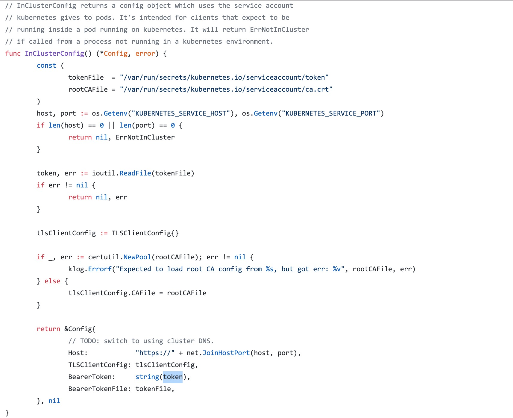


## ServiceAccount 

> `ServiceAccount` 主要是用于解决 Pod 在集群中的身份认证问题的。认证使用的授权信息其实就是利用前面我们讲到的一个类型为 

```
kubernetes.io/service-account-token
```

 进行管理的。

### 介绍 

> `ServiceAccount` 是命名空间级别的，每一个命名空间创建的时候就会自动创建一个名为 `default` 的 `ServiceAccount` 对象:

```
$ kubectl create ns kube-test
namespace/kube-test created
$ kubectl get sa -n kube-test
NAME      SECRETS   AGE
default   1         9s
$ kubectl get secret -n kube-test
NAME                  TYPE                                  DATA   AGE
default-token-vn4tr   kubernetes.io/service-account-token   3      2m27s
```

> 这个 `ServiceAccount` 会自动关联到一个 `Secret` 对象上：

```
$ kubectl get sa default -n kube-test  -o yaml
apiVersion: v1
kind: ServiceAccount
metadata:
  creationTimestamp: "2019-11-23T04:19:47Z"
  name: default
  namespace: kube-test
  resourceVersion: "4297522"
  selfLink: /api/v1/namespaces/kube-test/serviceaccounts/default
  uid: 75b3314b-e949-4f7b-9450-9bcd89c8c972
secrets:
- name: default-token-vn4tr
```

> 这个 Secret 对象是 ServiceAccount 控制器自动创建的，我们可以查看这个关联的 `Secret` 对象信息：

```
$ kubectl get secret default-token-vn4tr -n kube-test -o yaml
apiVersion: v1
data:
  ca.crt: LS0tLS...
  namespace: a3ViZS10ZXN0
  token: ZXlKaG...
kind: Secret
metadata:
  annotations:
    kubernetes.io/service-account.name: default
    kubernetes.io/service-account.uid: 75b3314b-e949-4f7b-9450-9bcd89c8c972
  creationTimestamp: "2019-11-23T04:19:47Z"
  name: default-token-vn4tr
  namespace: kube-test
  resourceVersion: "4297521"
  selfLink: /api/v1/namespaces/kube-test/secrets/default-token-vn4tr
  uid: e3e60f95-f255-471b-a6c0-600a3c0ee53a
type: kubernetes.io/service-account-token
```

> 在 `data` 区域我们可以看到有3个信息：

*   `ca.crt`：用于校验服务端的证书信息
*   `namespace`：表示当前管理的命名空间
*   `token`：用于 Pod 身份认证的 Token

> 前面我们也提到了默认情况下当前 namespace 下面的 Pod 会默认使用 `default` 这个 ServiceAccount，对应的 `Secret` 会自动挂载到 Pod 的 

```
/var/run/secrets/kubernetes.io/serviceaccount/
```

 目录中，这样我们就可以在 Pod 里面获取到用于身份认证的信息了。

### 实现原理 

> 实际上这个自动挂载过程是在 Pod 创建的时候通过 

```
Admisson Controller（准入控制器）
```

 来实现的，关于准入控制器的详细信息我们会在后面的安全章节中和大家继续学习。

> Admisson Controller

> ```
Admission Controller（准入控制）
```

是 Kubernetes API Server 用于拦截请求的一种手段。`Admission` 可以做到对请求的资源对象进行校验，修改，Pod 创建时 `Admission Controller` 会根据指定的的 `ServiceAccount`（默认的 default）把对应的 `Secret` 挂载到容器中的固定目录下 

```
/var/run/secrets/kubernetes.io/serviceaccount/
```

。

> 然后当我们在 Pod 里面访问集群的时候，就可以默认利用挂载到 Pod 内部的 `token` 文件来认证 Pod 的身份，`ca.crt` 则用来校验服务端。在 Pod 中访问 Kubernetes 集群的一个典型的方式如下图所示：

> 

> 代码中我们指定了 `ServiceAccount` 背后的 Secret 挂载到 Pod 里面的两个文件：`token` 和 `ca.crt`，然后通过环境变量获取到 APIServer 的访问地址（前面我们提到过会把 Service 信息通过环境变量的方式注入到 Pod 中），然后通过 `ca.cart` 校验服务端是否可信，最后服务端会根据我们提供的 `token` 文件对 Pod 进行认证。

> Pod 身份被认证合法过后，具体具有哪些资源的访问权限，就需要通过后面的 `RBAC` 来进行声明了。所以我们在学习 Kubernetes 的权限认证的时候需要把整个流程弄清楚，`ServiceAccount` 是干嘛的？为什么还需要 `RBAC`？这些都是上下文关联的。