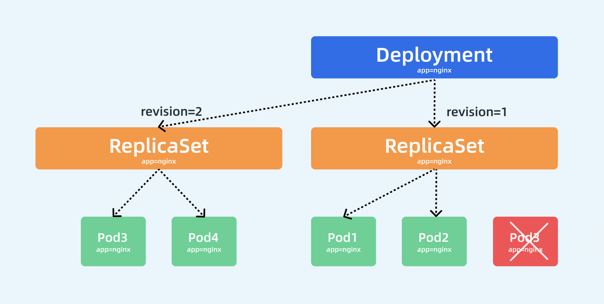

## Deployment 控制器 

> 前面我们学习了 ReplicaSet 控制器，了解到该控制器是用来维护集群中运行的 Pod 数量的，但是往往在实际操作的时候，我们反而不会去直接使用 RS，而是会使用更上层的控制器，比如我们今天要学习的主角 Deployment，Deployment 一个非常重要的功能就是实现了 Pod 的水平扩展/收缩，比如我们应用更新了，我们只需要更新我们的容器镜像，然后修改 Deployment 里面的 Pod 模板镜像，那么 Deployment 就会用`滚动更新（Rolling Update）`的方式来升级现在的 Pod，这个能力是非常重要的，因为对于线上的服务我们需要做到不中断服务，所以滚动更新就成了必须的一个功能。而 Deployment 这个能力的实现，依赖的就是上节课我们学习的 ReplicaSet 这个资源对象，实际上我们可以通俗的理解就是`每个 Deployment 就对应集群中的一次部署`，这样就更好理解了。

### Deployment 

> Deployment 资源对象的格式和 ReplicaSet 几乎一致，如下资源对象就是一个常见的 Deployment 资源类型：（nginx-deploy.yaml）

```
apiVersion: apps/v1
kind: Deployment  
metadata:
  name:  nginx-deploy
  namespace: default
spec:
  replicas: 3  # 期望的 Pod 副本数量，默认值为1
  selector:  # Label Selector，必须匹配 Pod 模板中的标签
    matchLabels:
      app: nginx
  template:  # Pod 模板
    metadata:
      labels:
        app: nginx
    spec:
      containers:
      - name: nginx
        image: nginx
        ports:
        - containerPort: 80
```

> 我们这里只是将类型替换成了 Deployment，我们可以先来创建下这个资源对象：

```
$ kubectl apply -f nginx-deploy.yaml
deployment.apps/nginx-deploy created
$ kubectl get deployment
NAME           READY   UP-TO-DATE   AVAILABLE   AGE
nginx-deploy   3/3     3            3           58s
```

> 创建完成后，查看 Pod 状态：

```
$ kubectl get pods -l app=nginx
NAME                            READY   STATUS    RESTARTS   AGE
nginx-deploy-85ff79dd56-7r76h   1/1     Running   0          41s
nginx-deploy-85ff79dd56-d5gjs   1/1     Running   0          41s
nginx-deploy-85ff79dd56-txc4h   1/1     Running   0          41s
```

> 到这里我们发现和之前的 RS 对象是否没有什么两样，都是根据`spec.replicas`来维持的副本数量，我们随意查看一个 Pod 的描述信息：

```
$ kubectl describe pod nginx-deploy-85ff79dd56-txc4h
Name:               nginx-deploy-85ff79dd56-txc4h
Namespace:          default
Priority:           0
PriorityClassName:  <none>
Node:               ydzs-node1/122
Start Time:         Sat, 16 Nov 2019 16:01:25 +0800
Labels:             app=nginx
                    pod-template-hash=85ff79dd56
Annotations:        podpreset.admission.kubernetes.io/podpreset-time-preset: 2062768
Status:             Running
IP:                 2166
Controlled By:      ReplicaSet/nginx-deploy-85ff79dd56
......
Events:
  Type    Reason     Age        From                 Message
  ----    ------     ----       ----                 -------
  Normal  Scheduled  <unknown>  default-scheduler    Successfully assigned default/nginx-deploy-85ff79dd56-txc4h to ydzs-node1
  Normal  Pulling    2m         kubelet, ydzs-node1  Pulling image "nginx"
  Normal  Pulled     117s       kubelet, ydzs-node1  Successfully pulled image "nginx"
  Normal  Created    117s       kubelet, ydzs-node1  Created container nginx
  Normal  Started    116s       kubelet, ydzs-node1  Started container nginx
```

> 我们仔细查看其中有这样一个信息

```
Controlled By: ReplicaSet/nginx-deploy-85ff79dd56
```

，什么意思？是不是表示当前我们这个 Pod 的控制器是一个 ReplicaSet 对象啊，我们不是创建的一个 Deployment 吗？为什么 Pod 会被 RS 所控制呢？那我们再去看下这个对应的 RS 对象的详细信息如何呢：

```
$ kubectl describe rs nginx-deploy-85ff79dd56
Name:           nginx-deploy-85ff79dd56
Namespace:      default
Selector:       app=nginx,pod-template-hash=85ff79dd56
Labels:         app=nginx
                pod-template-hash=85ff79dd56
Annotations:    deployment.kubernetes.io/desired-replicas: 3
                deployment.kubernetes.io/max-replicas: 4
                deployment.kubernetes.io/revision: 1
Controlled By:  Deployment/nginx-deploy
Replicas:       3 current / 3 desired
Pods Status:    3 Running / 0 Waiting / 0 Succeeded / 0 Failed
......
Events:
  Type    Reason            Age    From                   Message
  ----    ------            ----   ----                   -------
  Normal  SuccessfulCreate  4m52s  replicaset-controller  Created pod: nginx-deploy-85ff79dd56-7r76h
  Normal  SuccessfulCreate  4m52s  replicaset-controller  Created pod: nginx-deploy-85ff79dd56-d5gjs
  Normal  SuccessfulCreate  4m52s  replicaset-controller  Created pod: nginx-deploy-85ff79dd56-txc4h
```

> 其中有这样的一个信息：

```
Controlled By: Deployment/nginx-deploy
```

，明白了吧？意思就是我们的 Pod 依赖的控制器 RS 实际上被我们的 Deployment 控制着呢，我们可以用下图来说明 Pod、ReplicaSet、Deployment 三者之间的关系：

> 

> 通过上图我们可以很清楚的看到，定义了3个副本的 Deployment 与 ReplicaSet 和 Pod 的关系，就是一层一层进行控制的。ReplicaSet 作用和之前一样还是来保证 Pod 的个数始终保存指定的数量，所以 Deployment 中的容器 `restartPolicy=Always` 是唯一的就是这个原因，因为容器必须始终保证自己处于 Running 状态，ReplicaSet 才可以去明确调整 Pod 的个数。而 Deployment 是通过管理 ReplicaSet 的数量和属性来实现`水平扩展/收缩`以及`滚动更新`两个功能的。

### 水平伸缩 

> `水平扩展/收缩`的功能比较简单，因为 ReplicaSet 就可以实现，所以 Deployment 控制器只需要去修改它缩控制的 ReplicaSet 的 Pod 副本数量就可以了。比如现在我们把 Pod 的副本调整到 4 个，那么 Deployment 所对应的 ReplicaSet 就会自动创建一个新的 Pod 出来，这样就水平扩展了，我们可以使用一个新的命令 `kubectl scale` 命令来完成这个操作：

```
$ kubectl scale deployment nginx-deploy --replicas=4
deployment.apps/nginx-deployment scaled
```

> 扩展完成后可以查看当前的 RS 对象：

```
$ kubectl get rs
NAME                      DESIRED   CURRENT   READY   AGE
nginx-deploy-85ff79dd56   4         4         3       40m
```

> 可以看到期望的 Pod 数量已经变成 4 了，只是 Pod 还没准备完成，所以 READY 状态数量还是 3，同样查看 RS 的详细信息：

```
$ kubectl describe rs nginx-deploy-85ff79dd56
Name:           nginx-deploy-85ff79dd56
Namespace:      default
Selector:       app=nginx,pod-template-hash=85ff79dd56
......
Events:
  Type    Reason            Age   From                   Message
  ----    ------            ----  ----                   -------
  Normal  SuccessfulCreate  40m   replicaset-controller  Created pod: nginx-deploy-85ff79dd56-7r76h
  Normal  SuccessfulCreate  40m   replicaset-controller  Created pod: nginx-deploy-85ff79dd56-d5gjs
  Normal  SuccessfulCreate  40m   replicaset-controller  Created pod: nginx-deploy-85ff79dd56-txc4h
  Normal  SuccessfulCreate  17s   replicaset-controller  Created pod: nginx-deploy-85ff79dd56-tph9g
```

> 可以看到 ReplicaSet 控制器增加了一个新的 Pod，同样的 Deployment 资源对象的事件中也可以看到完成了扩容的操作：

```
$ kubectl describe deploy nginx-deploy
Name:                   nginx-deploy
Namespace:              default
......
OldReplicaSets:  <none>
NewReplicaSet:   nginx-deploy-85ff79dd56 (4/4 replicas created)
Events:
  Type    Reason             Age    From                   Message
  ----    ------             ----   ----                   -------
  Normal  ScalingReplicaSet  43m    deployment-controller  Scaled up replica set nginx-deploy-85ff79dd56 to 3
  Normal  ScalingReplicaSet  3m16s  deployment-controller  Scaled up replica set nginx-deploy-85ff79dd56 to 4
```

### 滚动更新 

> 如果只是`水平扩展/收缩`这两个功能，就完全没必要设计 Deployment 这个资源对象了，Deployment 最突出的一个功能是支持`滚动更新`，比如现在我们需要把应用容器更改为 `nginx:1.7.9` 版本，修改后的资源清单文件如下所示：

```
apiVersion: apps/v1
kind: Deployment  
metadata:
  name:  nginx-deploy
  namespace: default
spec:
  replicas: 3  
  selector:  
    matchLabels:
      app: nginx
  minReadySeconds: 5
  strategy:  
    type: RollingUpdate  # 指定更新策略：RollingUpdate和Recreate
    rollingUpdate:
      maxSurge: 1
      maxUnavailable: 1
  template:  
    metadata:
      labels:
        app: nginx
    spec:
      containers:
      - name: nginx
        image: nginx:9
        ports:
        - containerPort: 80
```

> 后前面相比较，除了更改了镜像之外，我们还指定了更新策略：

```
minReadySeconds: 5
strategy:
  type: RollingUpdate
  rollingUpdate:
    maxSurge: 1
    maxUnavailable: 1
```

*   `minReadySeconds`：表示 Kubernetes 在等待设置的时间后才进行升级，如果没有设置该值，Kubernetes 会假设该容器启动起来后就提供服务了，如果没有设置该值，在某些极端情况下可能会造成服务不正常运行，默认值就是0。
*   `type=RollingUpdate`：表示设置更新策略为滚动更新，可以设置为`Recreate`和`RollingUpdate`两个值，`Recreate`表示全部重新创建，默认值就是`RollingUpdate`。
*   `maxSurge`：表示升级过程中最多可以比原先设置多出的 Pod 数量，例如：

    ```
    maxSurage=1，replicas=5
    ```

    ，就表示Kubernetes 会先启动一个新的 Pod，然后才删掉一个旧的 Pod，整个升级过程中最多会有`5+1`个 Pod。
*   `maxUnavaible`：表示升级过程中最多有多少个 Pod 处于无法提供服务的状态，当`maxSurge`不为0时，该值也不能为0，例如：`maxUnavaible=1`，则表示 Kubernetes 整个升级过程中最多会有1个 Pod 处于无法服务的状态。

> 现在我们来直接更新上面的 Deployment 资源对象：

```
$ kubectl apply -f nginx-deploy.yaml
```

> record 参数

> 我们可以添加了一个额外的 `--record` 参数来记录下我们的每次操作所执行的命令，以方便后面查看。

> 更新后，我们可以执行下面的 

```
kubectl rollout status
```

 命令来查看我们此次滚动更新的状态：

```
$ kubectl rollout status deployment/nginx-deploy
Waiting for deployment "nginx-deploy" rollout to finish: 2 out of 3 new replicas have been updated...
```

> 从上面的信息可以看出我们的滚动更新已经有两个 Pod 已经更新完成了，在滚动更新过程中，我们还可以执行如下的命令来暂停更新：

```
$ kubectl rollout pause deployment/nginx-deploy
deployment.apps/nginx-deploy paused
```

> 这个时候我们的滚动更新就暂停了，此时我们可以查看下 Deployment 的详细信息：

```
$ kubectl describe deploy nginx-deploy
Name:                   nginx-deploy
Namespace:              default
CreationTimestamp:      Sat, 16 Nov 2019 16:01:24 +0800
Labels:                 <none>
Annotations:            deployment.kubernetes.io/revision: 2
                        kubectl.kubernetes.io/last-applied-configuration:
                          {"apiVersion":"apps/v1","kind":"Deployment","metadata":{"annotations":{},"name":"nginx-deploy","namespace":"default"},"spec":{"minReadySec...
Selector:               app=nginx
Replicas:               3 desired | 2 updated | 4 total | 4 available | 0 unavailable
StrategyType:           RollingUpdate
MinReadySeconds:        5
RollingUpdateStrategy:  1 max unavailable, 1 max surge
......
OldReplicaSets:  nginx-deploy-85ff79dd56 (2/2 replicas created)
NewReplicaSet:   nginx-deploy-5b7b9ccb95 (2/2 replicas created)
Events:
  Type    Reason             Age    From                   Message
  ----    ------             ----   ----                   -------
  Normal  ScalingReplicaSet  26m    deployment-controller  Scaled up replica set nginx-deploy-85ff79dd56 to 4
  Normal  ScalingReplicaSet  3m44s  deployment-controller  Scaled down replica set nginx-deploy-85ff79dd56 to 3
  Normal  ScalingReplicaSet  3m44s  deployment-controller  Scaled up replica set nginx-deploy-5b7b9ccb95 to 1
  Normal  ScalingReplicaSet  3m44s  deployment-controller  Scaled down replica set nginx-deploy-85ff79dd56 to 2
  Normal  ScalingReplicaSet  3m44s  deployment-controller  Scaled up replica set nginx-deploy-5b7b9ccb95 to 2
```

> 

> 我们仔细观察 Events 事件区域的变化，上面我们用 `kubectl scale` 命令将 Pod 副本调整到了 4，现在我们更新的时候是不是声明又变成 3 了，所以 Deployment 控制器首先是将之前控制的 

```
nginx-deploy-85ff79dd56
```

 这个 RS 资源对象进行缩容操作，然后滚动更新开始了，可以发现 Deployment 为一个新的 

```
nginx-deploy-5b7b9ccb95
```

 RS 资源对象首先新建了一个新的 Pod，然后将之前的 RS 对象缩容到 2 了，再然后新的 RS 对象扩容到 2，后面由于我们暂停滚动升级了，所以没有后续的事件了，大家有看明白这个过程吧？这个过程就是滚动更新的过程，启动一个新的 Pod，杀掉一个旧的 Pod，然后再启动一个新的 Pod，这样滚动更新下去，直到全都变成新的 Pod，这个时候系统中应该存在 4 个 Pod，因为我们设置的策略`maxSurge=1`，所以在升级过程中是允许的，而且是两个新的 Pod，两个旧的 Pod：

```
$ kubectl get pods -l app=nginx
NAME                            READY   STATUS    RESTARTS   AGE
nginx-deploy-5b7b9ccb95-k6pkh   1/1     Running   0          11m
nginx-deploy-5b7b9ccb95-l6lmx   1/1     Running   0          11m
nginx-deploy-85ff79dd56-7r76h   1/1     Running   0          75m
nginx-deploy-85ff79dd56-txc4h   1/1     Running   0          75m
```

> 查看 Deployment 的状态也可以看到当前的 Pod 状态：

```
$ kubectl get deployment  
NAME           READY   UP-TO-DATE   AVAILABLE   AGE
nginx-deploy   4/3     2            4           75m
```

> 这个时候我们可以使用

```
kubectl rollout resume
```

来恢复我们的滚动更新：

```
$ kubectl rollout resume deployment/nginx-deploy
deployment.apps/nginx-deploy resumed
$ kubectl rollout status deployment/nginx-deploy
Waiting for deployment "nginx-deploy" rollout to finish: 2 of 3 updated replicas are available...
deployment "nginx-deploy" successfully rolled out
```

> 看到上面的信息证明我们的滚动更新已经成功了，同样可以查看下资源状态：

```
$ kubectl get pod -l app=nginx
NAME                            READY   STATUS    RESTARTS   AGE
nginx-deploy-5b7b9ccb95-gmq7v   1/1     Running   0          115s
nginx-deploy-5b7b9ccb95-k6pkh   1/1     Running   0          15m
nginx-deploy-5b7b9ccb95-l6lmx   1/1     Running   0          15m
$ kubectl get deployment                        
NAME           READY   UP-TO-DATE   AVAILABLE   AGE
nginx-deploy   3/3     3            3           79m
```

> 这个时候我们查看 ReplicaSet 对象，可以发现会出现两个：

```
$ kubectl get rs -l app=nginx
NAME                      DESIRED   CURRENT   READY   AGE
nginx-deploy-5b7b9ccb95   3         3         3       18m
nginx-deploy-85ff79dd56   0         0         0       81m
```

> 从上面可以看出滚动更新之前我们使用的 RS 资源对象的 Pod 副本数已经变成 0 了，而滚动更新后的 RS 资源对象变成了 3 个副本，我们可以导出之前的 RS 对象查看：

```
$ kubectl get rs nginx-deploy-85ff79dd56 -o yaml
apiVersion: apps/v1
kind: ReplicaSet
metadata:
  annotations:
    deployment.kubernetes.io/desired-replicas: "3"
    deployment.kubernetes.io/max-replicas: "4"
    deployment.kubernetes.io/revision: "1"
  creationTimestamp: "2019-11-16T08:01:24Z"
  generation: 5
  labels:
    app: nginx
    pod-template-hash: 85ff79dd56
  name: nginx-deploy-85ff79dd56
  namespace: default
  ownerReferences:
  - apiVersion: apps/v1
    blockOwnerDeletion: true
    controller: true
    kind: Deployment
    name: nginx-deploy
    uid: b0fc5614-ef58-496c-9111-740353bd90d4
  resourceVersion: "2140545"
  selfLink: /apis/apps/v1/namespaces/default/replicasets/nginx-deploy-85ff79dd56
  uid: 8eca2998-3610-4f80-9c21-5482ba579892
spec:
  replicas: 0
  selector:
    matchLabels:
      app: nginx
      pod-template-hash: 85ff79dd56
  template:
    metadata:
      creationTimestamp: null
      labels:
        app: nginx
        pod-template-hash: 85ff79dd56
    spec:
      containers:
      - image: nginx
        imagePullPolicy: Always
        name: nginx
        ports:
        - containerPort: 80
          protocol: TCP
        resources: {}
        terminationMessagePath: /dev/termination-log
        terminationMessagePolicy: File
      dnsPolicy: ClusterFirst
      restartPolicy: Always
      schedulerName: default-scheduler
      securityContext: {}
      terminationGracePeriodSeconds: 30
status:
  observedGeneration: 5
  replicas: 0
```

> 我们仔细观察这个资源对象里面的描述信息除了副本数变成了`replicas=0`之外，和更新之前没有什么区别吧？大家看到这里想到了什么？有了这个 RS 的记录存在，是不是我们就可以回滚了啊？而且还可以回滚到前面的任意一个版本，这个版本是如何定义的呢？我们可以通过命令 `rollout history` 来获取：

```
$ kubectl rollout history deployment nginx-deploy
deployment.apps/nginx-deploy 
REVISION  CHANGE-CAUSE
1         <none>
2         <none>
```

> 其实 `rollout history` 中记录的 `revision` 是和 `ReplicaSets` 一一对应。如果我们手动删除某个 `ReplicaSet`，对应的`rollout history`就会被删除，也就是说你无法回滚到这个`revison`了，同样我们还可以查看一个`revison`的详细信息：

```
$ kubectl rollout history deployment nginx-deploy --revision=1 
deployment.apps/nginx-deploy with revision #1
Pod Template:
  Labels:       app=nginx
        pod-template-hash=85ff79dd56
  Containers:
   nginx:
    Image:      nginx
    Port:       80/TCP
    Host Port:  0/TCP
    Environment:        <none>
    Mounts:     <none>
  Volumes:      <none>
```

> 假如现在要直接回退到当前版本的前一个版本，我们可以直接使用如下命令进行操作：

```
$ kubectl rollout undo deployment nginx-deploy
```

> 当然也可以回退到指定的`revision`版本：

```
$ kubectl rollout undo deployment nginx-deploy --to-revision=1
deployment "nginx-deploy" rolled back
```

> 回滚的过程中我们同样可以查看回滚状态：

```
$ kubectl rollout status deployment/nginx-deploy
Waiting for deployment "nginx-deploy" rollout to finish: 1 old replicas are pending termination...
Waiting for deployment "nginx-deploy" rollout to finish: 1 old replicas are pending termination...
Waiting for deployment "nginx-deploy" rollout to finish: 1 old replicas are pending termination...
Waiting for deployment "nginx-deploy" rollout to finish: 2 of 3 updated replicas are available...
Waiting for deployment "nginx-deploy" rollout to finish: 2 of 3 updated replicas are available...
deployment "nginx-deploy" successfully rolled out
```

> 这个时候查看对应的 RS 资源对象可以看到 Pod 副本已经回到之前的 RS 里面去了。

```
$ kubectl get rs -l app=nginx
NAME                      DESIRED   CURRENT   READY   AGE
nginx-deploy-5b7b9ccb95   0         0         0       31m
nginx-deploy-85ff79dd56   3         3         3       95m
```

> 不过需要注意的是回滚的操作滚动的`revision`始终是递增的：

```
$ kubectl rollout history deployment nginx-deploy
deployment.apps/nginx-deploy 
REVISION  CHANGE-CAUSE
2         <none>
3         <none>
```

> 保留旧版本

> 在很早之前的 Kubernetes 版本中，默认情况下会为我们暴露下所有滚动升级的历史记录，也就是 ReplicaSet 对象，但一般情况下没必要保留所有的版本，毕竟会存在 etcd 中，我们可以通过配置 

```
spec.revisionHistoryLimit
```

 属性来设置保留的历史记录数量，不过新版本中该值默认为 10，如果希望多保存几个版本可以设置该字段。