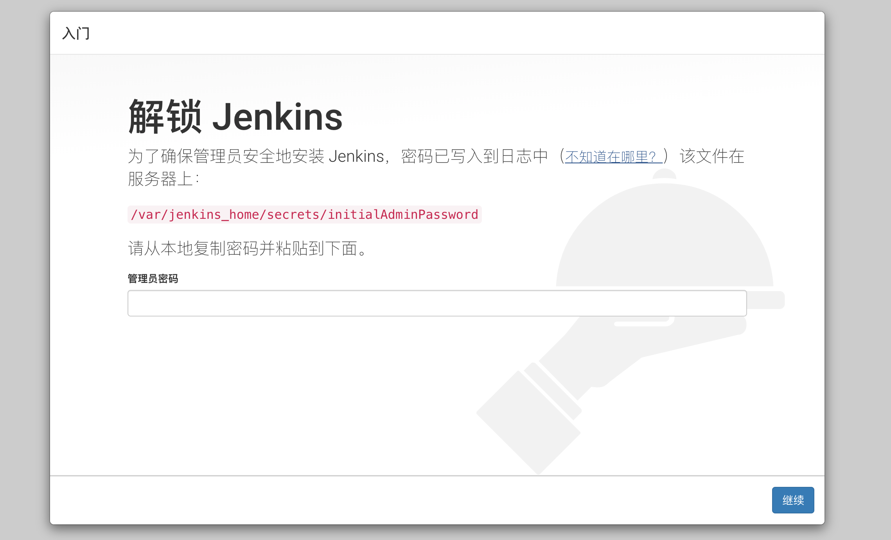
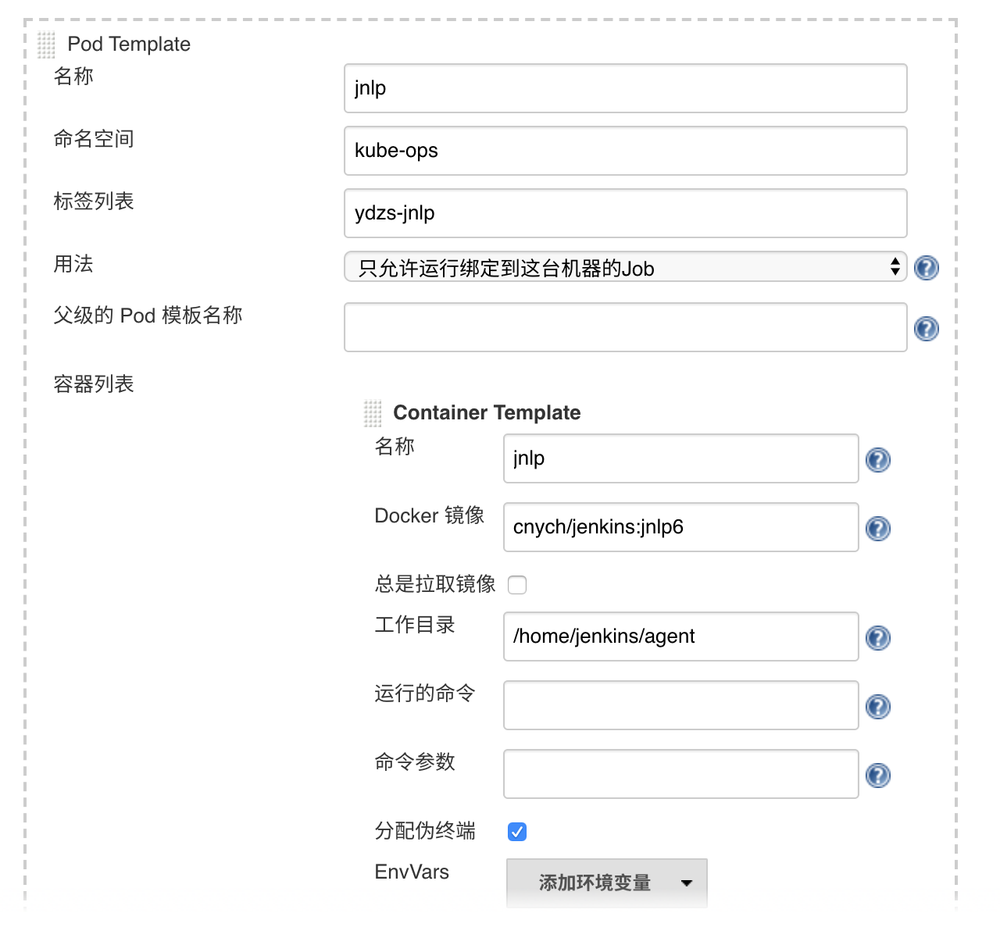
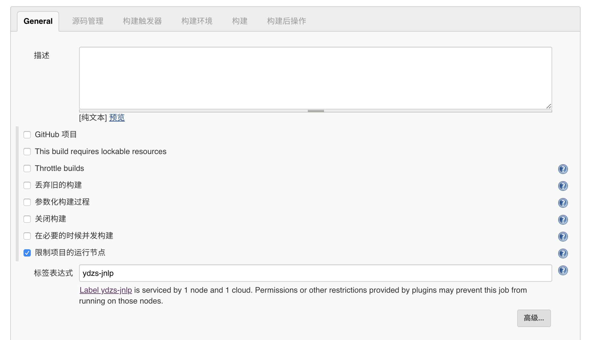
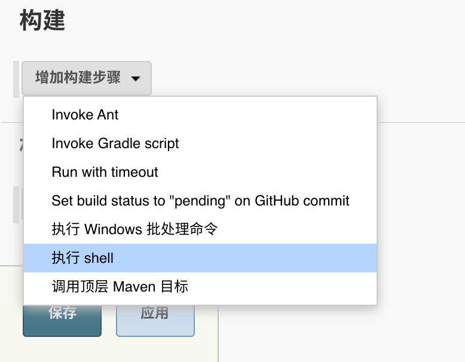
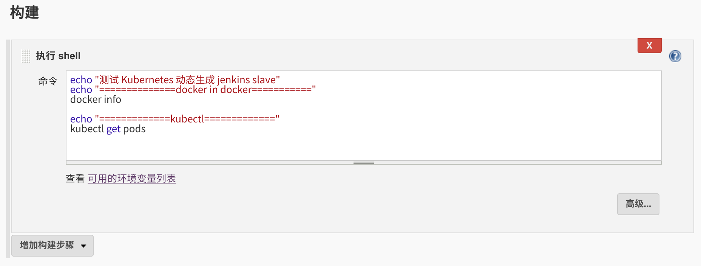

## Jenkins

> 提到基于 Kubernete 的CI/CD，可以使用的工具有很多，比如 Jenkins、Gitlab CI 以及新兴的 drone 之类的，我们这里会使用大家最为熟悉的 Jenkins 来做 CI/CD 的工具。

### 安装

> 既然要基于 Kubernetes 来做 CI/CD，我们这里最好还是将 Jenkins 安装到 Kubernetes 集群当中，安装的方式也很多，我们这里仍然还是使用手动的方式，这样可以了解更多细节，对应的资源清单文件如下所示：

```
apiVersion: v1
kind: PersistentVolume
metadata:
  name: jenkins-pv
spec:
  storageClassName: local  # Local PV
  capacity:
    storage: 2Gi
  volumeMode: Filesystem
  accessModes:
  - ReadWriteOnce
  local:  
    path: /data/k8s/jenkins
  nodeAffinity:
    required:
      nodeSelectorTerms:
      - matchExpressions:
        - key: kubernetes.io/hostname
          operator: In
          values:
          - ydzs-node6
---
apiVersion: v1
kind: PersistentVolumeClaim
metadata:
  name: jenkins-pvc
  namespace: kube-ops
spec:
  storageClassName: local
  accessModes:
  - ReadWriteOnce
  resources:
    requests:
      storage: 2Gi
---
apiVersion: v1
kind: ServiceAccount
metadata:
  name: jenkins
  namespace: kube-ops
---
kind: ClusterRole
apiVersion: rbac.authorization.k8s.io/v1beta1
metadata:
  name: jenkins
rules:
  - apiGroups: ["extensions", "apps"]
    resources: ["deployments", "ingresses"]
    verbs: ["create", "delete", "get", "list", "watch", "patch", "update"]
  - apiGroups: [""]
    resources: ["services"]
    verbs: ["create", "delete", "get", "list", "watch", "patch", "update"]
  - apiGroups: [""]
    resources: ["pods"]
    verbs: ["create","delete","get","list","patch","update","watch"]
  - apiGroups: [""]
    resources: ["pods/exec"]
    verbs: ["create","delete","get","list","patch","update","watch"]
  - apiGroups: [""]
    resources: ["pods/log", "events"]
    verbs: ["get","list","watch"]
  - apiGroups: [""]
    resources: ["secrets"]
    verbs: ["get"]
---
apiVersion: rbac.authorization.k8s.io/v1beta1
kind: ClusterRoleBinding
metadata:
  name: jenkins
  namespace: kube-ops
roleRef:
  apiGroup: rbac.authorization.k8s.io
  kind: ClusterRole
  name: jenkins
subjects:
  - kind: ServiceAccount
    name: jenkins
    namespace: kube-ops
---
apiVersion: v1
kind: ConfigMap
metadata:
  name: jenkins-mirror-conf
  namespace: kube-ops
data:
  nginx.conf: |
    user nginx;
    worker_processes  3;
    error_log  /dev/stderr;
    events {
      worker_connections  10240;
    }
    http {
      log_format main '$remote_addr - $remote_user [$time_local] "$request" '
                      '$status $body_bytes_sent "$http_referer" '
                      '"$http_user_agent" "$http_x_forwarded_for" $request_time';
      access_log    /dev/stdout main;
      server {
          listen 80;
          server_name mirrors.jenkins-ci.org;
          location / {
            proxy_redirect off;
            proxy_pass https://mirrors.tuna.tsinghua.edu.cn/jenkins/;
            proxy_set_header X-Real-IP $remote_addr;
            proxy_set_header X-Forwarded-For $proxy_add_x_forwarded_for;
            proxy_set_header Accept-Encoding "";
            proxy_set_header Accept-Language "zh-CN";
          }
          index index.html index.htm index.php;
          location ~ /\. {
            deny all;
          }
      }
    }
---
apiVersion: apps/v1
kind: Deployment
metadata:
  name: jenkins
  namespace: kube-ops
spec:
  selector:
    matchLabels:
      app: jenkins
  template:
    metadata:
      labels:
        app: jenkins
    spec:
      serviceAccount: jenkins
      hostAliases:
      - ip: "11"
        hostnames:
        - "mirrors.jenkins-ci.org"
      initContainers:
      - name: fix-permissions
        image: busybox
        command: ["sh", "-c", "chown -R 1000:1000 /var/jenkins_home"]
        securityContext:
          privileged: true
        volumeMounts:
        - name: jenkinshome
          mountPath: /var/jenkins_home
      containers:
      - name: mirror
        image: nginx:9
        ports:
        - containerPort: 80
        volumeMounts:
        - mountPath: /etc/nginx 
          readOnly: true
          name: nginx-conf
      - name: jenkins
        image: jenkins/jenkins:lts
        imagePullPolicy: IfNotPresent
        ports:
        - containerPort: 8080
          name: web
          protocol: TCP
        - containerPort: 50000
          name: agent
          protocol: TCP
        resources:
          limits:
            cpu: 1500m
            memory: 2048Mi
          requests:
            cpu: 1500m
            memory: 2048Mi
        readinessProbe:
          httpGet:
            path: /login
            port: 8080
          initialDelaySeconds: 60
          timeoutSeconds: 5
          failureThreshold: 12
        volumeMounts:
        - name: jenkinshome
          mountPath: /var/jenkins_home
      volumes:
      - name: jenkinshome
        persistentVolumeClaim:
          claimName: jenkins-pvc
      - name: nginx-conf
        configMap:
          name: jenkins-mirror-conf
          items:
          - key: nginx.conf
            path: nginx.conf
---
apiVersion: v1
kind: Service
metadata:
  name: jenkins
  namespace: kube-ops
  labels:
    app: jenkins
spec:
  selector:
    app: jenkins
  ports:
  - name: web
    port: 8080
    targetPort: web
  - name: agent
    port: 50000
    targetPort: agent
# ---
# apiVersion: extensions/v1beta1
# kind: Ingress
# metadata:
#   name: jenkins
#   namespace: kube-ops
# spec:
#   rules:
#   - host: jenkins.k8s.local
#     http:
#       paths:
#       - backend:
#           serviceName: jenkins
#           servicePort: web
---
apiVersion: traefik.containo.us/v1alpha1
kind: IngressRoute
metadata:
  name: jenkins
  namespace: kube-ops
spec:
  entryPoints:
  - web   
  routes:
  - kind: Rule
    match: Host(`jenkins.k8s.local`)
    services:
    - name: jenkins
      port: 8080
```

> 我们这里使用一个名为 `jenkins/jenkins:lts` 的镜像，这是 jenkins 官方的 Docker 镜像，然后也有一些环境变量，当然我们也可以根据自己的需求来定制一个镜像，比如我们可以将一些插件打包在自定义的镜像当中，可以参考文档：https://github.com/jenkinsci/docker，我们这里使用默认的官方镜像就行，另外一个还需要注意的数据的持久化，将容器的 `/var/jenkins_home` 目录持久化即可，同样为了性能考虑，我们这里使用 Local PV，将 Pod 调度到固定的节点上。

> 由于我们这里使用的镜像内部运行的用户 `uid=1000`，所以我们这里挂载出来后会出现权限问题，为解决这个问题，我们同样还是用一个简单的 `initContainer` 来修改下我们挂载的数据目录。

> 另外我们这里还需要使用到一个拥有相关权限的 

```
serviceAccount：jenkins
```

，我们这里只是给 jenkins 赋予了一些必要的权限，当然如果你对 serviceAccount 的权限不是很熟悉的话，我们给这个 sa 绑定一个 `cluster-admin` 的集群角色权限也是可以的，当然这样具有一定的安全风险。

> 除此之外，这里我们还添加了一个额外的名为 `mirror` 的容器，添加这个容器的目的是使用一个 nginx 容器来反向代理 Jenkins 插件的官方源到清华大学的源上面，因为官方源实在是太慢了，我们这里将官方的镜像地址 

```
mirrors.jenkins-ci.org
```

 通过 `hostAlias` 映射到了 `127.0.0.1` 这个地址上，而这个地址恰好就是 `mirror` 这个 nginx 容器，我们通过一个 ConfigMap 来配置 Nginx，将 

```
mirros.jenkins-ci.org
```

 反向代理到了 

```
proxy_pass https://mirrors.tuna.tsinghua.edu.cn/jenkins/;
```

，这样当我们在 Jenkins 中要下载插件的时候实际上会被代理到清华的源上面去，这样就大大加快了插件下载的速度。

> 最后就是通过 IngressRoute 来暴露我们的服务，这个比较简单。

> 我们直接来创建 jenkins 的资源清单即可：

```
$ kubectl apply -f jenkins.yaml
$ kubectl get pods -n kube-ops -l app=jenkins
NAME                       READY   STATUS    RESTARTS   AGE
jenkins-5b957d4b8f-t22gp   2/2     Running   0          18m
$ kubectl logs -f jenkins-5b957d4b8f-t22gp jenkins -n kube-ops
......
2019-12-16 13:26:756+0000 [id=39]    INFO    hudson.model.AsyncPeriodicWork$1#run: Finished Download metadata. 28,073 ms
2019-12-16 13:26:760+0000 [id=26]    INFO    jenkins.InitReactorRunner$1#onAttained: Completed initialization
2019-12-16 13:26:863+0000 [id=19]    INFO    hudson.WebAppMain$3#run: Jenkins is fully up and running
```

> 看到上面的 

```
run: Jenkins is fully up and running
```

 信息就证明我们的 Jenkins 应用以前启动起来了。

> 然后我们可以通过 IngressRoute 中定义的域名 `jenkins.k8s.local`(需要做 DNS 解析或者在本地 `/etc/hosts` 中添加映射)来访问 jenkins 服务：

> 

> 然后可以执行下面的命令获取解锁的管理员密码：

```
$ kubectl exec -it jenkins-5b957d4b8f-t22gp -c jenkins -n kube-ops -- cat /var/jenkins_home/secrets/initialAdminPassword
35b083de1d25409eaef57255e0da481a   # jenkins启动日志里面也有
```

> 然后选择安装推荐的插件即可，由于我们已经做了插件的反向代理了，所以理论上安装速度会比较快

> 

> 安装完成后添加管理员帐号即可进入到 jenkins 主界面：

> 

### 架构

> Jenkins 安装完成了，接下来我们不用急着就去使用，我们要了解下在 Kubernetes 环境下面使用 Jenkins 有什么好处。

> 我们知道持续构建与发布是我们日常工作中必不可少的一个步骤，目前大多公司都采用 Jenkins 集群来搭建符合需求的 CI/CD 流程，然而传统的 Jenkins Slave 一主多从方式会存在一些痛点，比如：

*   主 Master 发生单点故障时，整个流程都不可用了
*   每个 Slave 的配置环境不一样，来完成不同语言的编译打包等操作，但是这些差异化的配置导致管理起来非常不方便，维护起来也是比较费劲
*   资源分配不均衡，有的 Slave 要运行的 job 出现排队等待，而有的 Slave 处于空闲状态
*   资源有浪费，每台 Slave 可能是物理机或者虚拟机，当 Slave 处于空闲状态时，也不会完全释放掉资源。

> 正因为上面的这些种种痛点，我们渴望一种更高效更可靠的方式来完成这个 CI/CD 流程，而 Docker 虚拟化容器技术能很好的解决这个痛点，又特别是在 Kubernetes 集群环境下面能够更好来解决上面的问题，下图是基于 Kubernetes 搭建 Jenkins 集群的简单示意图：

> 

> 从图上可以看到 `Jenkins Master` 和 `Jenkins Slave` 以 Pod 形式运行在 Kubernetes 集群的 Node 上，Master 运行在其中一个节点，并且将其配置数据存储到一个 Volume 上去，Slave 运行在各个节点上，并且它不是一直处于运行状态，它会按照需求动态的创建并自动删除。

> 这种方式的工作流程大致为：当 Jenkins Master 接受到 Build 请求时，会根据配置的 Label 动态创建一个运行在 Pod 中的 Jenkins Slave 并注册到 Master 上，当运行完 Job 后，这个 Slave 会被注销并且这个 Pod 也会自动删除，恢复到最初状态。

> 那么我们使用这种方式带来了哪些好处呢？

*   `服务高可用`，当 Jenkins Master 出现故障时，Kubernetes 会自动创建一个新的 Jenkins Master 容器，并且将 Volume 分配给新创建的容器，保证数据不丢失，从而达到集群服务高可用。
*   `动态伸缩`，合理使用资源，每次运行 Job 时，会自动创建一个 Jenkins Slave，Job 完成后，Slave 自动注销并删除容器，资源自动释放，而且 Kubernetes 会根据每个资源的使用情况，动态分配 Slave 到空闲的节点上创建，降低出现因某节点资源利用率高，还排队等待在该节点的情况。
*   `扩展性好`，当 Kubernetes 集群的资源严重不足而导致 Job 排队等待时，可以很容易的添加一个 Kubernetes Node 到集群中，从而实现扩展。 是不是以前我们面临的种种问题在 Kubernetes 集群环境下面是不是都没有了啊？看上去非常完美。

### 配置

> 接下来我们就需要来配置 Jenkins，让他能够动态的生成 Slave 的 Pod。

> 第1步. 我们需要安装 kubernetes 插件， 点击 Manage Jenkins -> Manage Plugins -> Available -> Kubernetes 勾选安装即可。

> 

> 第2步. 安装完毕后，点击 Manage Jenkins —> Configure System —> (拖到最下方)，如果有 `Add a new cloud` —> 选择 Kubernetes，然后填写 Kubernetes 和 Jenkins 配置信息即可，但是最新版本的 Kubernetes 插件将配置单独放置到了一个页面中：

> 

> 这个时候需要点击 

```
a separate configuration page
```

 这个链接，跳转到 `Configure Cloud` 页面：

> 

> 在该页面我们可以点击 `Add a new cloud` -> 选择 Kubernetes，然后填写 Kubernetes 和 Jenkins 配置信息：

> 

> 注意 namespace，我们这里填 kube-ops，然后点击 `Test Connection`，如果出现 

```
Connection test successful
```

 的提示信息证明 Jenkins 已经可以和 Kubernetes 系统正常通信了，然后下方的 Jenkins URL 地址：

```
http://jenkins.kube-ops.svc.cluster.local:8080
```

，这里的格式为：

```
服务名.namespace.svc.cluster.local:8080
```

，根据上面创建的 jenkins 的服务名填写。

> 第3步. 配置 `Pod Template`，其实就是配置 Jenkins Slave 运行的 Pod 模板，命名空间我们同样是用 kube-ops，Labels 这里也非常重要，对于后面执行 Job 的时候需要用到该值，然后我们这里使用的是 `cnych/jenkins:jnlp6` 这个镜像，这个镜像是在官方的 jnlp 镜像基础上定制的，加入了 docker、kubectl 等一些实用的工具。

> 

> 注意

> 容器的名称必须是 jnlp，这是默认拉起的容器，另外需要将 `Command to run` 和 

```
Arguments to pass to the command
```

 的值都删除掉，否则会失败。

> 然后我们这里需要在下面挂载两个主机目录，一个是 `/var/run/docker.sock`，该文件是用于 Pod 中的容器能够共享宿主机的 Docker，这就是大家说的 `docker in docker` 的方式，Docker 二进制文件已经打包到上面的镜像中了，另外一个目录下 `/root/.kube` 目录，我们将这个目录挂载到容器的 `/root/.kube` 目录下面这是为了让我们能够在 Pod 的容器中能够使用 `kubectl` 工具来访问我们的 Kubernetes 集群，方便我们后面在 `Slave Pod` 部署 Kubernetes 应用。

> 

> 另外如果在配置了后运行 Slave Pod 的时候出现了权限问题，这是因为 Jenkins Slave Pod 中没有配置权限，所以需要配置上 ServiceAccount，在 Slave Pod 配置的地方点击下面的高级，添加上对应的 ServiceAccount 即可：

> 

> 到这里我们的 Kubernetes 插件就算配置完成了。

### 测试

> Kubernetes 插件的配置工作完成了，接下来我们就来添加一个 Job 任务，看是否能够在 Slave Pod 中执行，任务执行完成后看 Pod 是否会被销毁。

> 在 Jenkins 首页点击 `create new jobs`，创建一个测试的任务，输入任务名称，然后我们选择 `Freestyle project` 类型的任务，注意在下面的 `Label Expression` 这里要填入 `ydzs-jnlp`，就是前面我们配置的 Slave Pod 中的 Label，这两个地方必须保持一致：

> 

> 然后往下拉，在 Build 区域选择`Execute shell`

> 

> 然后输入我们测试命令

```
echo "测试 Kubernetes 动态生成 jenkins slave"
echo "docker in docker"
docker info

echo "kubectl"
kubectl get pods
```

> 最后点击保存

> 

> 现在我们直接在页面点击左侧的 `Build now` 触发构建即可，然后观察 Kubernetes 集群中 Pod 的变化：

```
$ kubectl get pods -n kube-ops                        
NAME                                           READY   STATUS              RESTARTS   AGE
jenkins-68ccff445c-dk24f                       1/1     Running             0          12h
jnlp-1g893                                     0/1     ContainerCreating   0          83s
```

> 我们可以看到在我们点击立刻构建的时候可以看到一个新的 Pod：jnlp-1g893 被创建了，这就是我们的 Jenkins Slave。任务执行完成后我们可以看到任务信息，比如我们这里是 花费了 21s 时间在 jnlp-1g893 这个 Slave上面

> 

> 到这里证明我们的任务已经构建完成，然后这个时候我们再去集群查看我们的 Pod 列表，发现 kube-ops 这个 namespace 下面已经没有之前的 Slave 这个 Pod 了。

```
$ kubectl get pods -n kube-ops                        
NAME                                           READY   STATUS              RESTARTS   AGE
jenkins-68ccff445c-dk24f                       1/1     Running             0          12h
```

> 到这里我们就完成了使用 Kubernetes 动态生成 Jenkins Slave 的方法。