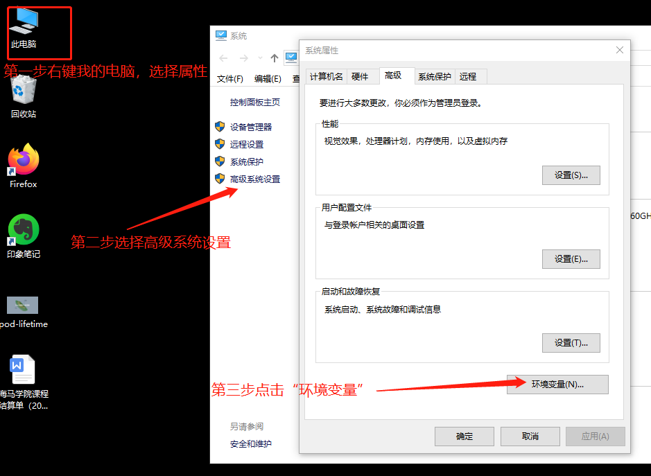
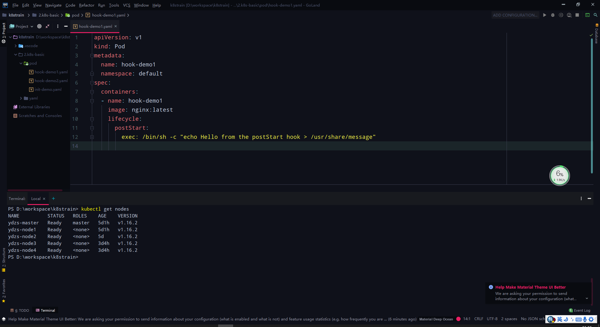

## 技巧

> Kubernetes 使用过程中的一些奇技淫巧

### Windows 系统最佳实践

> 有部分同学是使用的 Windows 系统，我们的直播课程也是在 Windows 系统下面进行的，然后通过 SSH 方式连接到 服务器上面操作 Kubernetes，由于对 vim 不是很熟悉，所以又通过 sftp 的方式在本地编写资源清单文件同步到服务器上面执行的，这个过程比较繁琐，效率不高。下面就来介绍下在 Windows 系统下面配置 kubectl 的实践方式，当然如果你是 Mac 或者 Linux，思路基本都是一致的。

### kubectl 配置

> 首先，下载 Windows 版本的 kubectl 二进制文件，地址：https://dl.k8s.io/v1.26.2/kubernetes-client-windows-amd64.tar.gz。

> 下载链接

> 由于上面下载链接需要科学上网，所以我这里离线放到到了百度网盘上，可以直接下载：

```
链接：https://pan.baidu.com/s/1w_2s3mzf1OWSlvgVZFssCA
提取码：fxbc
复制这段内容后打开百度网盘手机App，操作更方便哦
```

> 将 kubectl 二进制文件下载到本地，解压到目录：`D:\apps\kubernetes` 下面，然后设置该目录到 PATH 路径下面，操作步骤如下所示：

> 

> 

> 这样设置完成后就可以在终端中直接直接 kubectl 命令了。现在只需要配置 kubeconfig 文件就可以访问我们的 Kubernetes 集群了。

> 首先创建 `.kube` 目录：

```
$ mkdir ~/.kube  # 对应目录: C:\\Users\\Admin\.kube
```

> 然后将服务器上面的 

```
kubeconfig（～/.kube/config）
```

文件复制到 Windows 下面的 `～/.kube` 目录下面，但是需要注意的是服务器上面的`kubeconfig`配置文件里面的 apiserver 地址是`内网地址`，所以我们把这里的地址改成外网IP，保存，然后测试 kubectl 命令：

```
$ kubectl version
Client Version: version.Info{Major:"1", Minor:"16", GitVersion:"v2", GitCommit:"c97fe5036ef3df2967d086711e6c0c405941e14b", GitTreeState:"clean", BuildDate:"2019-10-15T19:18:23Z", GoVersion:"go10", Compiler:"gc", Platform:"windows/amd64"}
Unable to connect to the server: x509: certificate is valid for 1, 111, not 1111
```

> 我们可以看到会提示证书错误，大概意思就是服务端的证书没有包含我们的外网 IP，所以我们通过外网 IP 去访问就证书校验失败了，这个时候怎么办呢？要解决这个问题主要有两个方法：

> 第一个就是在我们最开始初始化集群的时候通过 kubeadm 的配置文件指定参数 apiServerCertSANs 的时候，将外网IP也包含着里面，但是我们集群已经安装好了，这个方法肯定不适用了。

> 第二个方法我们去服务器上面看看我们的 apiserver 证书的详细信息：

```
$ openssl x509 -in /etc/kubernetes/pki/apiserver.crt -noout -text
Certificate:
    Data:
        Version: 3 (0x2)
        Serial Number: 9203698167925060590 (0x7fba1ab86f1633ee)
    Signature Algorithm: sha256WithRSAEncryption
        Issuer: CN=kubernetes
        ......
        X509v3 extensions:
            X509v3 Key Usage: critical
                Digital Signature, Key Encipherment
            X509v3 Extended Key Usage:
                TLS Web Server Authentication
            X509v3 Subject Alternative Name:
                DNS:ydzs-master, DNS:kubernetes, DNS:kubernetes.default, DNS:kubernetes.default.svc, DNS:kubernetes.default.svc.cluster.local, IP Address:1, IP Address:111
    Signature Algorithm: sha256WithRSAEncryption
         01:1a:63:1a:f8:4e:f4:cd:7c:79:4b:64:2d:4e:a3:5a:13:80:
         13:60:ca:46:ee:2d:3e:61:51:15:45:19:23:2a:09:d9:46:b3:
        ......
```

> 我们仔细看上面 DNS 区域就是包含的校验的域名，后面还有 IP，是不是其中就有我们的 master 节点的 

```
hostname（ydzs-master）
```

，到这里大家想到方法了吗？

> 我们是不是可以直接在本地的 `/etc/hosts` 里面做一个 APIServer 的`外网 IP -> ydzs-master` 的映射，然后在本地的 kubeconfig 文件中把 apiserver 地址替换成 

```
https://ydzs-master:6443
```

 是不是就 OK了啊。

> 所以接下来直接在本地修改 hosts 映射即可，要注意用管理员身份打开文件 

```
C:\Windows\System32\drivers\etc\hosts
```

，然后在文件里面添加一行映射：

```
# localhost name resolution is handled within DNS itself.
#    11       localhost
#    ::1             localhost
1111 ydzs-master
```

> 然后保存即可。这个时候我们再到 powershell 中去执行下 kubectl 命令呢：

```
$ kubectl version
Client Version: version.Info{Major:"1", Minor:"16", GitVersion:"v2", GitCommit:"c97fe5036ef3df2967d086711e6c0c405941e14b", GitTreeState:"clean", BuildDate:"2019-10-15T19:18:23Z", GoVersion:"go10", Compiler:"gc", Platform:"windows/amd64"}
Server Version: version.Info{Major:"1", Minor:"16", GitVersion:"v2", GitCommit:"c97fe5036ef3df2967d086711e6c0c405941e14b", GitTreeState:"clean", BuildDate:"2019-10-15T19:09:08Z", GoVersion:"go10", Compiler:"gc", Platform:"linux/amd64"}
```

> 是不是全都 OK 了呀~

### IDE 配置

> 当然 kubectl 工具配置好以后，我们就可以直接操作集群了，随便用什么工具编写 YAML 清单文件操作都可以，当然为了更好的实践方式，可以选择一些比较顺手的工具，比如 vscode 之类的编辑器，我这里使用的是 `Goland` 这个 IDE。对于 Idea 的 IDE 都可以一样的操作。

*   为了页面美观，可以安装一个 `Material Theme UI` 的主题插件
*   为了编写 YAML 文件方便，还需要安装一个名为 `kubernetes` 的插件，这样我们在编写资源清单的时候就可以自动提示了
*   更改默认的 IDE 的 terminal 为 Powershell：

    ```
    open File=>Setting=>Tools=>Terminal
    ```

    , 将`cmd.exe`修改为`powershell.exe`保存，重启 IDE 即可。

> 最终的配置效果如下图所示：

> 