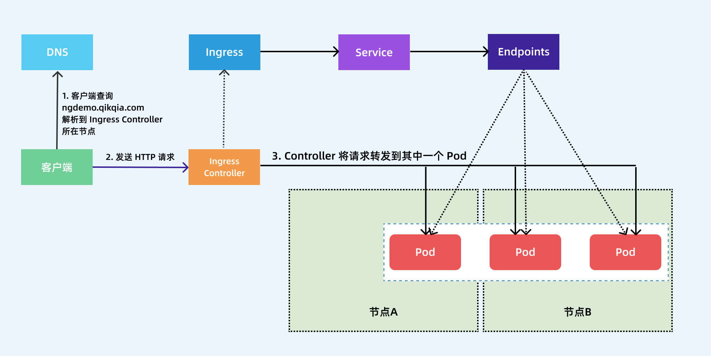


## Ingress 

> 对外暴露集群服务

> 前面我们学习了在 Kubernetes 集群内部使用 kube-dns 实现服务发现的功能，那么我们部署在 Kubernetes 集群中的应用如何暴露给外部的用户使用呢？我们知道可以使用 `NodePort` 和 `LoadBlancer` 类型的 Service 可以把应用暴露给外部用户使用，除此之外，Kubernetes 还为我们提供了一个非常重要的资源对象可以用来暴露服务给外部用户，那就是 `Ingress`。对于小规模的应用我们使用 NodePort 或许能够满足我们的需求，但是当你的应用越来越多的时候，你就会发现对于 NodePort 的管理就非常麻烦了，这个时候使用 Ingress 就非常方便了，可以避免管理大量的端口。

> Ingress 其实就是从 Kuberenets 集群外部访问集群的一个入口，将外部的请求转发到集群内不同的 Service 上，其实就相当于 nginx、haproxy 等负载均衡代理服务器，可能你会觉得我们直接使用 nginx 就实现了，但是只使用 nginx 这种方式有很大缺陷，每次有新服务加入的时候怎么改 Nginx 配置？不可能让我们去手动更改或者滚动更新前端的 Nginx Pod 吧？那我们再加上一个服务发现的工具比如 consul 如何？貌似是可以，对吧？Ingress 实际上就是这样实现的，只是服务发现的功能自己实现了，不需要使用第三方的服务了，然后再加上一个域名规则定义，路由信息的刷新依靠 Ingress Controller 来提供。

> Ingress Controller 可以理解为一个监听器，通过不断地监听 kube-apiserver，实时的感知后端 Service、Pod 的变化，当得到这些信息变化后，Ingress Controller 再结合 Ingress 的配置，更新反向代理负载均衡器，达到服务发现的作用。其实这点和服务发现工具 consul、 consul-template 非常类似。

> 

> 现在可以供大家使用的 Ingress Controller 有很多，比如 traefik、nginx-controller、Kubernetes Ingress Controller for Kong、HAProxy Ingress controller，当然你也可以自己实现一个 Ingress Controller，现在普遍用得较多的是 traefik 和 nginx-controller，traefik 的性能较 nginx-controller 差，但是配置使用要简单许多，我们这里会重点给大家介绍 nginx-controller 以及 traefik 的使用。

### NGINX Ingress Controller 

> NGINX Ingress Controller 是使用 Kubernetes Ingress 资源对象构建的，用 ConfigMap 来存储 Nginx 配置的一种 Ingress Controller 实现。

> 要使用 Ingress 对外暴露服务，就需要提前安装一个 Ingress Controller，我们这里就先来安装 NGINX Ingress Controller，由于 nginx-ingress 所在的节点需要能够访问外网，这样域名可以解析到这些节点上直接使用，所以需要让 nginx-ingress 绑定节点的 80 和 443 端口，所以可以使用 hostPort 来进行访问，当然对于线上环境来说为了保证高可用，一般是需要运行多个 nginx-ingress 实例的，然后可以用一个 nginx/haproxy 作为入口，通过 keepalived 来访问边缘节点的 vip 地址。

> 边缘节点

> 所谓的边缘节点即集群内部用来向集群外暴露服务能力的节点，集群外部的服务通过该节点来调用集群内部的服务，边缘节点是集群内外交流的一个Endpoint。

> 所以我们这里需要更改下资源清单文件：

```
$ wget https://raw.githubusercontent.com/kubernetes/ingress-nginx/nginx-1/deploy/static/mandatory.yaml
$ cat mandatory.yaml
...
tolerations:  # 由于我这里的边缘节点只有master一个节点，所有需要加上容忍
- operator: "Exists"
nodeSelector:  # 固定在边缘节点
  kubernetes.io/hostname: ydzs-master
containers:
  - name: nginx-ingress-controller
    image: quay.io/kubernetes-ingress-controller/nginx-ingress-controller:1
    args:
    - /nginx-ingress-controller
    - --configmap=$(POD_NAMESPACE)/nginx-configuration
    - --tcp-services-configmap=$(POD_NAMESPACE)/tcp-services
    - --udp-services-configmap=$(POD_NAMESPACE)/udp-services
    - --publish-service=$(POD_NAMESPACE)/ingress-nginx
    - --annotations-prefix=nginx.ingress.kubernetes.io
    securityContext:
    allowPrivilegeEscalation: true
    capabilities:
      drop:
        - ALL
      add:
        - NET_BIND_SERVICE
    # www-data -> 33
    runAsUser: 33
    env:
    - name: POD_NAME
      valueFrom:
        fieldRef:
          fieldPath: metadata.name
    - name: POD_NAMESPACE
      valueFrom:
        fieldRef:
          fieldPath: metadata.namespace
    ports:
    - name: http
      hostPort: 80  # 使用hostPort
      containerPort: 80
    - name: https
      hostPort: 443  # 使用hostPort
      containerPort: 443
...
$ kubectl apply -f mandatory.yaml
```

> 安装后会将 NGINX Ingress Controller 安装在一个统一的 ingress-nginx 的 namespace 下面：

```
$ kubectl get pods -n ingress-nginx
NAME                                       READY   STATUS    RESTARTS   AGE
nginx-ingress-controller-565459444-6m4cz   1/1     Running   0          38s
```

> 安装完成后，我们可以在 controller 的 Pod 所在节点使用如下方式进行验证：

```
$ curl 11
<html>
<head><title>404 Not Found</title></head>
<body>
<center><h1>404 Not Found</h1></center>
<hr><center>openresty/2</center>
</body>
</html>
```

> 出现了上面的信息证明 Ingress Controller 已经安装成功。

### Ingress 

> 安装成功后，现在我们来为一个 nginx 应用创建一个 Ingress 资源，如下所示：

```
apiVersion: apps/v1
kind: Deployment
metadata:
  name: my-nginx
spec:
  selector:
    matchLabels:
      app: my-nginx
  template:
    metadata:
      labels:
        app: my-nginx
    spec:
      containers:
      - name: my-nginx
        image: nginx
        ports:
        - containerPort: 80
---
apiVersion: v1
kind: Service
metadata:
  name: my-nginx
  labels:
    app: my-nginx
spec:
  ports:
  - port: 80
    protocol: TCP
    name: http
  selector:
    app: my-nginx
---
apiVersion: extensions/v1beta1
kind: Ingress
metadata:
  name: my-nginx
  annotations:
    kubernetes.io/ingress.class: "nginx"
spec:
  rules:
  - host: ngdemo.qikqiak.com  # 将域名映射到 my-nginx 服务
    http:
      paths:
      - path: /
        backend:
          serviceName: my-nginx  # 将所有请求发送到 my-nginx 服务的 80 端口
          servicePort: 80     # 不过需要注意大部分Ingress controller都不是直接转发到Service
                            # 而是只是通过Service来获取后端的Endpoints列表，直接转发到Pod，这样可以减少网络跳转，提高性能
```

> 直接创建上面的资源对象：

```
$ kubectl apply -f ngdemo.yaml
deployment.apps "my-nginx" created
service "my-nginx" created
ingress.extensions "my-nginx" created
```

> 注意我们在 Ingress 资源对象中添加了一个 annotations：

```
kubernetes.io/ingress.class: "nginx"
```

，这就是指定让这个 Ingress 通过 nginx-ingress 来处理。

> 上面资源创建成功后，然后我们可以将域名`ngdemo.qikqiak.com`解析到`nginx-ingress`所在的`边缘节点`中的任意一个，当然也可以在本地`/etc/hosts`中添加对应的映射也可以，然后就可以通过域名进行访问了。

> 

> 下图显示了客户端是如果通过 Ingress Controller 连接到其中一个 Pod 的流程，客户端首先对 `ngdemo.qikqiak.com` 执行 DNS 解析，得到 Ingress Controller 所在节点的 IP，然后客户端向 Ingress Controller 发送 HTTP 请求，然后根据 Ingress 对象里面的描述匹配域名，找到对应的 Service 对象，并获取关联的 Endpoints 列表，将客户端的请求转发给其中一个 Pod。

> 

### URL Rewrite 

> NGINX Ingress Controller 很多高级的用法可以通过 Ingress 对象的 `annotation` 进行配置，比如常用的 URL Rewrite 功能，比如我们有一个 todo 的前端应用，对应的 Ingress 资源对象如下所示：

```
apiVersion: extensions/v1beta1
kind: Ingress
metadata:
  name: fe
  namespace: default
  annotations:
    kubernetes.io/ingress.class: "nginx"
spec:
  rules:
  - host: todo.qikqiak.com
    http:
      paths:
      - backend:
          serviceName: fe
          servicePort: 3000
        path: /
```

> 就是一个很常规的 `Ingress` 对象，部署该对象后，将域名解析后就可以正常访问到应用：

> 

> 现在我们需要对访问的 URL 路径做一个 Rewrite，比如在 PATH 中添加一个 app 的前缀，关于 Rewrite 的操作在 ingress-nginx 官方文档中也给出对应的说明:

> 

> 按照要求我们需要在 `path` 中匹配前缀 `app`，然后通过 `rewrite-target` 指定目标，修改后的 Ingress 对象如下所示：

```
apiVersion: extensions/v1beta1
kind: Ingress
metadata:
  name: fe
  namespace: default
  annotations:
    kubernetes.io/ingress.class: "nginx"
    nginx.ingress.kubernetes.io/rewrite-target: /$2
spec:
  rules:
  - host: todo.qikqiak.com
    http:
      paths:
      - backend:
          serviceName: fe
          servicePort: 3000
        path: /app(/|$)(.*)
```

> 更新后，我们可以遇见到直接访问域名肯定是不行了，因为我们没有匹配 `/` 的 path 路径：

> 

> 但是我们带上 `app` 的前缀再去访问:

> 

> 我们可以看到已经可以访问到页面内容了，这是因为我们在 `path` 中通过正则表达式 `/app(/|$)(.*)` 将匹配的路径设置成了 `rewrite-target` 的目标路径了，所以我们访问 `todo.qikqiak.com/app` 的时候实际上相当于访问的就是后端服务的 `/` 路径，但是我们也可以发现现在页面的样式没有了：

> 

> 这是因为应用的静态资源路径是在 `/stylesheets` 路径下面的，现在我们做了 url rewrite 过后，要正常访问也需要带上前缀才可以：

```
http://todo.qikqiak.com/stylesheets/screen.css
```

，对于图片或者其他静态资源也是如此，当然我们去更改页面引入静态资源的方式为相对路径也是可以的，但是毕竟要修改代码，这个时候我们可以借助 `ingress-nginx` 中的 

```
configuration-snippet
```

 来对静态资源做一次跳转，如下所示：

```
apiVersion: extensions/v1beta1
kind: Ingress
metadata:
  name: fe
  namespace: default
  annotations:
    kubernetes.io/ingress.class: "nginx"
    nginx.ingress.kubernetes.io/rewrite-target: /$2
    nginx.ingress.kubernetes.io/configuration-snippet: |
      rewrite ^/stylesheets/(.*)$ /app/stylesheets/$1 redirect;  # 添加 /app 前缀
      rewrite ^/images/(.*)$ /app/images/$1 redirect;  # 添加 /app 前缀
spec:
  rules:
  - host: todo.qikqiak.com
    http:
      paths:
      - backend:
          serviceName: fe
          servicePort: 3000
        path: /app(/|$)(.*)
```

> 更新 Ingress 对象后，这个时候我们刷新页面可以看到已经正常了：

> 

> 要解决我们访问主域名出现 404 的问题，我们可以给应用设置一个 `app-root` 的注解，这样当我们访问主域名的时候会自动跳转到我们指定的 `app-root` 目录下面，如下所示：

```
apiVersion: extensions/v1beta1
kind: Ingress
metadata:
  name: fe
  namespace: default
  annotations:
    kubernetes.io/ingress.class: "nginx"
    nginx.ingress.kubernetes.io/app-root: /app/
    nginx.ingress.kubernetes.io/rewrite-target: /$2
    nginx.ingress.kubernetes.io/configuration-snippet: |
      rewrite ^/stylesheets/(.*)$ /app/stylesheets/$1 redirect;  # 添加 /app 前缀
      rewrite ^/images/(.*)$ /app/images/$1 redirect;  # 添加 /app 前缀
spec:
  rules:
  - host: todo.qikqiak.com
    http:
      paths:
      - backend:
          serviceName: fe
          servicePort: 3000
        path: /app(/|$)(.*)
```

> 这个时候我们更新应用后访问主域名 

```
http://todo.qikqiak.com
```

 就会自动跳转到 

```
http://todo.qikqiak.com/app/
```

 路径下面去了。但是还有一个问题是我们的 path 路径其实也匹配了 `/app` 这样的路径，可能我们更加希望我们的应用在最后添加一个 `/` 这样的 slash，同样我们可以通过 

```
configuration-snippet
```

 配置来完成，如下 Ingress 对象：

```
apiVersion: extensions/v1beta1
kind: Ingress
metadata:
  name: fe
  namespace: default
  annotations:
    kubernetes.io/ingress.class: "nginx"
    nginx.ingress.kubernetes.io/app-root: /app/
    nginx.ingress.kubernetes.io/rewrite-target: /$2
    nginx.ingress.kubernetes.io/configuration-snippet: |
      rewrite ^(/app)$ $1/ redirect;
      rewrite ^/stylesheets/(.*)$ /app/stylesheets/$1 redirect;
      rewrite ^/images/(.*)$ /app/images/$1 redirect;
spec:
  rules:
  - host: todo.qikqiak.com
    http:
      paths:
      - backend:
          serviceName: fe
          servicePort: 3000
        path: /app(/|$)(.*)
```

> 更新后我们的应用就都会以 `/` 这样的 slash 结尾了。这样就完成了我们的需求，如果你原本对 nginx 的配置就非常熟悉的话应该可以很快就能理解这种配置方式了。

### Basic Auth 

> 同样我们还可以在 Ingress Controller 上面配置一些基本的 Auth 认证，比如 Basic Auth，可以用 htpasswd 生成一个密码文件来验证身份验证。

```
$ htpasswd -c auth foo
New password:
Re-type new password:
Adding password for user foo
```

> 然后根据上面的 auth 文件创建一个 secret 对象：

```
$ kubectl create secret generic basic-auth --from-file=auth
secret/basic-auth created
$ kubectl get secret basic-auth -o yaml
apiVersion: v1
data:
  auth: Zm9vOiRhcHIxJFNjcVhZcFN6JDc4Nm5ISFNaeDdwN2VscDM2WUo0YS8K
kind: Secret
metadata:
  creationTimestamp: "2019-12-08T06:40:39Z"
  name: basic-auth
  namespace: default
  resourceVersion: "9197951"
  selfLink: /api/v1/namespaces/default/secrets/basic-auth
  uid: 6b2aa299-b511-412e-85ea-d0e91e578af0
type: Opaque
```

> 然后对上面的 my-nginx 应用创建一个具有 Basic Auth 的 Ingress 对象：

```
apiVersion: extensions/v1beta1
kind: Ingress
metadata:
  name: ingress-with-auth
  annotations:
    # 认证类型
    nginx.ingress.kubernetes.io/auth-type: basic
    # 包含 user/password 定义的 secret 对象名
    nginx.ingress.kubernetes.io/auth-secret: basic-auth
    # 要显示的带有适当上下文的消息，说明需要身份验证的原因
    nginx.ingress.kubernetes.io/auth-realm: 'Authentication Required - foo'
spec:
  rules:
  - host: foo.bar.com
    http:
      paths:
      - path: /
        backend:
          serviceName: my-nginx
          servicePort: 80
```

> 直接创建上面的资源对象，然后通过下面的命令或者在浏览器中直接打开配置的域名：

```
$ curl -v http://k8s.youdianzhishi.com -H 'Host: foo.bar.com'
* Rebuilt URL to: http://k8s.youdianzhishi.com/
*   Trying 11..
* TCP_NODELAY set
* Connected to k8s.youdianzhishi.com (1111) port 80 (#0)
> GET / HTTP/1
> Host: foo.bar.com
> User-Agent: curl/0
> Accept: */*
>
< HTTP/1 401 Unauthorized
< Server: openresty/2
< Date: Sun, 08 Dec 2019 06:44:35 GMT
< Content-Type: text/html
< Content-Length: 185
< Connection: keep-alive
< WWW-Authenticate: Basic realm="Authentication Required - foo"
<
<html>
<head><title>401 Authorization Required</title></head>
<body>
<center><h1>401 Authorization Required</h1></center>
<hr><center>openresty/2</center>
</body>
</html>
```

> 我们可以看到出现了 401 认证失败错误，然后带上我们配置的用户名和密码进行认证：

```
$ curl -v http://k8s.youdianzhishi.com -H 'Host: foo.bar.com' -u 'foo:foo'
* Rebuilt URL to: http://k8s.youdianzhishi.com/
*   Trying 11..
* TCP_NODELAY set
* Connected to k8s.youdianzhishi.com (1111) port 80 (#0)
* Server auth using Basic with user 'foo'
> GET / HTTP/1
> Host: foo.bar.com
> Authorization: Basic Zm9vOmZvbw==
> User-Agent: curl/0
> Accept: */*
>
< HTTP/1 200 OK
< Server: openresty/2
< Date: Sun, 08 Dec 2019 06:46:27 GMT
< Content-Type: text/html
< Content-Length: 612
< Connection: keep-alive
< Vary: Accept-Encoding
< Last-Modified: Tue, 19 Nov 2019 12:50:08 GMT
< ETag: "5dd3e500-264"
< Accept-Ranges: bytes
<
<!DOCTYPE html>
<html>
<head>
<title>Welcome to nginx!</title>
<style>
    body {
        width: 35em;
        margin: 0 auto;
        font-family: Tahoma, Verdana, Arial, sans-serif;
    }
</style>
</head>
<body>
<h1>Welcome to nginx!</h1>
<p>If you see this page, the nginx web server is successfully installed and
working. Further configuration is required.</p>

<p>For online documentation and support please refer to
<a href="http://nginx.org/">nginx.org</a>.<br/>
Commercial support is available at
<a href="http://nginx.com/">nginx.com</a>.</p>

<p><em>Thank you for using nginx.</em></p>
</body>
</html>
```

> 可以看到已经认证成功了。当然出来 Basic Auth 这一种简单的认证方式之外，NGINX Ingress Controller 还支持一些其他高级的认证，比如 OAUTH 认证之类的。

### HTTPS 

> 如果我们需要用 HTTPS 来访问我们这个应用的话，就需要监听 443 端口了，同样用 HTTPS 访问应用必然就需要证书，这里我们用 `openssl` 来创建一个自签名的证书：

```
$ openssl req -x509 -nodes -days 365 -newkey rsa:2048 -keyout tls.key -out tls.crt -subj "/CN=foo.bar.com"
```

> 然后通过 Secret 对象来引用证书文件：

```
# 要注意证书文件名称必须是 tls.crt 和 tls.key
$ kubectl create secret tls foo-tls --cert=tls.crt --key=tls.key
secret/who-tls created
```

> 这个时候我们就可以创建一个 HTTPS 访问应用的：

```
apiVersion: extensions/v1beta1
kind: Ingress
metadata:
  name: ingress-with-auth
  annotations:
    # 认证类型
    nginx.ingress.kubernetes.io/auth-type: basic
    # 包含 user/password 定义的 secret 对象名
    nginx.ingress.kubernetes.io/auth-secret: basic-auth
    # 要显示的带有适当上下文的消息，说明需要身份验证的原因
    nginx.ingress.kubernetes.io/auth-realm: 'Authentication Required - foo'
spec:
  rules:
  - host: foo.bar.com
    http:
      paths:
      - path: /
        backend:
          serviceName: my-nginx
          servicePort: 80
  tls:
  - hosts:
    - foo.bar.com
    secretName: foo-tls
```