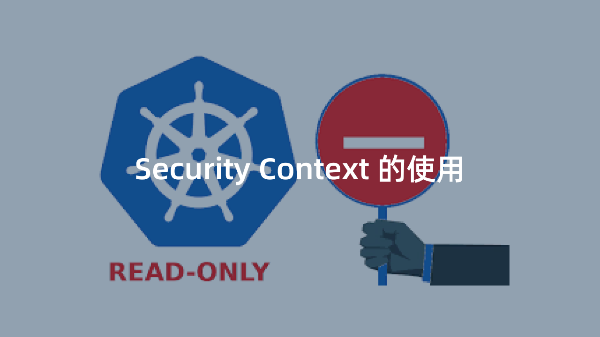
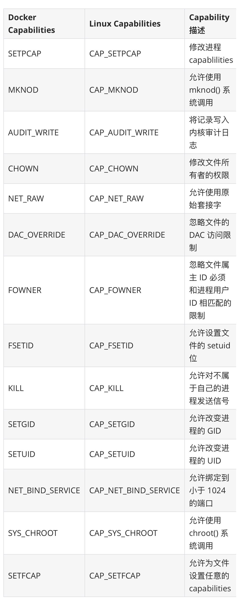

## Security Context 

> Kubernetes Pod/容器的安全管控

> 

> 我们有时候在运行一个容器的时候，可能需要使用 `sysctl` 命令来修改内核参数，比如 `net`、`vm`、`kernel` 等参数，但是 `systcl` 需要容器拥有超级权限，才可以使用，在 Docker 容器启动的时候我们可以加上 `--privileged` 参数来使用特权模式。那么在 Kubernetes 中应该如何来使用呢？

> 这个时候我们就需要使用到 Kubernetes 中的 `Security Context`，也就是常说的安全上下文，主要是来限制容器非法操作宿主节点的系统级别的内容，使得节点的系统或者节点上其他容器组受到影响。Kubernetes 提供了三种配置安全上下文级别的方法：

*   Container-level Security Context：仅应用到指定的容器
*   Pod-level Security Context：应用到 Pod 内所有容器以及 Volume
*   Pod Security Policies（PSP）：应用到集群内部所有 Pod 以及 Volume

> 我们可以用如下几种方式来设置 `Security Context`：

*   访问权限控制：根据用户 ID（UID）和组 ID（GID）来限制对资源（比如：文件）的访问权限
*   Security Enhanced Linux (SELinux)：为对象分配 `SELinux` 标签
*   以 privileged（特权）模式运行
*   Linux Capabilities：给某个特定的进程超级权限，而不用给 root 用户所有的 privileged 权限
*   AppArmor：使用程序文件来限制单个程序的权限
*   Seccomp：过滤容器中进程的系统调用（system call）
*   > AllowPrivilegeEscalation（允许特权扩大）：此项配置是一个布尔值，定义了一个进程是否可以比其父进程获得更多的特权，直接效果是，容器的进程上是否被设置 no_new_privs 标记。当出现如下情况时，AllowPrivilegeEscalation 的值始终为 true：

    *   容器以 `privileged` 模式运行
    *   容器拥有 `CAP_SYS_ADMIN` 的 Linux Capability

### 为 Pod 设置 Security Context 

> 我们只需要在 Pod 定义的资源清单文件中添加 `securityContext` 字段，就可以为 Pod 指定安全上下文相关的设定，通过该字段指定的内容将会对当前 Pod 中的所有容器生效。

```
apiVersion: v1
kind: Pod
metadata:
  name: security-context-pod-demo
spec:
  volumes:
  - name: sec-ctx-vol
    emptyDir: {}
  securityContext:
    runAsUser: 1000
    runAsGroup: 3000
    fsGroup: 2000
  containers:
  - name: sec-ctx-demo
    image: busybox
    command: ["sh", "-c", "sleep 60m"]
    volumeMounts:
    - name: sec-ctx-vol
      mountPath: /pod/demo
    securityContext:
      allowPrivilegeEscalation: false
```

> 在当前资源清单文件中我们在 Pod 下面添加了 `securityContext` 字段，其中：

*   > `runAsUser` 字段指定了该 Pod 中所有容器的进程都以 UID 1000 的身份运行，`runAsGroup` 字段指定了该 Pod 中所有容器的进程都以 GID 3000 的身份运行

    *   如果省略该字段，容器进程的 GID 为 `root(0)`
    *   容器中创建的文件，其所有者为 userID 1000，groupID 3000
*   > `fsGroup` 字段指定了该 Pod 的 fsGroup 为 2000

    *   数据卷 （对应挂载点 `/pod/demo` 的数据卷为 `sec-ctx-demo`） 的所有者以及在该数据卷下创建的任何文件，其 GID 都为 2000

> 下表是我们常用的一些 `securityContext` 字段设置内容介绍：

> 

> 直接创建上面的 Pod 对象：

```
$ kubectl apply -f https:/www.qikqiak.com/k8strain/security/manifests/security-context-pod-demo-yaml
$ kubectl get pods
NAME                        READY   STATUS    RESTARTS   AGE
security-context-pod-demo   1/1     Running   0          6m45s
```

> 运行完成后，我们可以验证下容器中的进程运行的 ownership：

```
$ kubectl exec security-context-pod-demo top
Mem: 7586020K used, 422948K free, 298660K shrd, 1247656K buff, 3867660K cached
CPU:  1% usr  0% sys  0% nic 3% idle  2% io  0% irq  0% sirq
Load average: 30 35 35 1/956 50
  PID  PPID USER     STAT   VSZ %VSZ CPU %CPU COMMAND
   46     0 1000     R     1292  0   0  0 top
    1     0 1000     S     1280  0   0  0 sleep 60m
```

> 我们直接运行一个 `top` 进程，查看容器中的所有正在执行的进程，我们可以看到 USER ID 都为 1000（`runAsUser` 指定的），然后查看下挂载的数据卷的 ownership：

```
$ kubectl exec security-context-pod-demo -- ls -la /pod
total 8
drwxr-xr-x    3 root     root          4096 Nov 26 15:44 .
drwxr-xr-x    1 root     root          4096 Nov 26 15:44 ..
drwxrwsrwx    2 root     2000             6 Nov 26 15:43 demo
```

> 因为上面我们指定了 `fsGroup=2000`，所以声明挂载的数据卷 `/pod/demo` 的 GID 也变成了 2000。直接调用容器中的 id 命令：

```
$ kubectl exec security-context-pod-demo id
uid=1000 gid=3000 groups=2000
```

> 我们可以看到 gid 为 3000，与 `runAsGroup` 字段所指定的一致，如果 `runAsGroup` 字段被省略，则 gid 取值为 0（即 root），此时容器中的进程将可以操作 root Group 的文件。

> 比如我们现在想要去删除容器中的 `/tmp` 目录就没有权限了，因为该目录的用户和组都是 root，而我们当前要去删除使用的进程的 ID 号就变成了 1000:3000，所以没有权限操作：

```
$ kubectl exec security-context-pod-demo -- ls -la /tmp
total 8
drwxrwxrwt    2 root     root          4096 Oct 29 02:40 .
drwxr-xr-x    1 root     root          4096 Nov 26 15:44 ..
$ kubectl exec security-context-pod-demo -- rm -rf /tmp
rm: can't remove '/tmp': Permission denied
```

### 为容器设置 Security Context 

> 除了在 Pod 中可以设置安全上下文之外，我们还可以单独为某个容器设置安全上下文，同样也是通过 `securityContext` 字段设置，当该字段的配置与 Pod 级别的 securityContext 配置相冲突时，容器级别的配置将覆盖 Pod 级别的配置。容器级别的 securityContext 不影响 Pod 中的数据卷。如下资源清单所示：

```
apiVersion: v1
kind: Pod
metadata:
  name: security-context-container-demo
spec:
  securityContext:
    runAsUser: 1000
  containers:
  - name: sec-ctx-demo
    image: busybox
    command: [ "sh", "-c", "sleep 60m" ]
    securityContext:
      runAsUser: 2000
      allowPrivilegeEscalation: false
```

> 直接创建上面的 Pod 对象：

```
$ kubectl apply -f https:/www.qikqiak.com/k8strain/security/manifests/security-context-pod-demo-yaml
$ kubectl get pods
NAME                              READY   STATUS              RESTARTS   AGE
security-context-container-demo   1/1     Running             0          5s
```

> 同样我们直接执行容器中的 `top` 命令：

```
$ kubectl exec security-context-container-demo top
Mem: 4991896K used, 3016924K free, 52308K shrd, 158364K buff, 3282996K cached
CPU:  6% usr  8% sys  6% nic 8% idle  0% io  0% irq  0% sirq
Load average: 12 09 12 1/848 10
  PID  PPID USER     STAT   VSZ %VSZ CPU %CPU COMMAND
    6     0 2000     R     1292  0   1  0 top
    1     0 2000     S     1280  0   3  0 sleep 60m
```

> 容器的进程以 UID 2000 的身份运行，该取值由 

```
spec.containers[*].securityContext.runAsUser
```

 容器组中的字段定义。Pod 中定义的 

```
spec.securityContext.runAsUser
```

 取值 1000 被覆盖。

### 设置 Linux Capabilities 

> 我们使用 `docker run` 的时候可以通过 `--cap-add` 和 `--cap-drop` 命令来给容器添加 `Linux Capabilities`。那么在 Kubernetes 下面如何来设置呢？要了解如何设置，首先我们还是需要了解下 `Linux Capabilities` 是什么？

### Linux Capabilities 

> 要了解 `Linux Capabilities`，这就得从 Linux 的权限控制发展来说明。在 Linux 2.2 版本之前，当内核对进程进行权限验证的时候，Linux 将进程划分为两类：特权进程（UID=0，也就是超级用户）和非特权进程（UID!=0），特权进程拥有所有的内核权限，而非特权进程则根据进程凭证（effective UID, effective GID，supplementary group 等）进行权限检查。

> 比如我们以常用的 `passwd` 命令为例，修改用户密码需要具有 root 权限，而普通用户是没有这个权限的。但是实际上普通用户又可以修改自己的密码，这是怎么回事呢？在 Linux 的权限控制机制中，有一类比较特殊的权限设置，比如 SUID(Set User ID on execution)，允许用户以可执行文件的 owner 的权限来运行可执行文件。因为程序文件 `/bin/passwd` 被设置了 `SUID` 标识，所以普通用户在执行 passwd 命令时，进程是以 passwd 的所有者，也就是 root 用户的身份运行，从而就可以修改密码了。

> 但是使用 `SUID` 却带来了新的安全隐患，当我们运行设置了 `SUID` 的命令时，通常只是需要很小一部分的特权，但是 `SUID` 却给了它 root 具有的全部权限，一旦 被设置了 `SUID` 的命令出现漏洞，是不是就很容易被利用了。

> 为此 Linux 引入了 `Capabilities` 机制来对 root 权限进行了更加细粒度的控制，实现按需进行授权，这样就大大减小了系统的安全隐患。

#### 什么是 Capabilities 

> 从内核 2.2 开始，Linux 将传统上与超级用户 root 关联的特权划分为不同的单元，称为 `capabilites`。`Capabilites` 每个单元都可以独立启用和禁用。这样当系统在作权限检查的时候就变成了：`在执行特权操作时，如果进程的有效身份不是 root，就去检查是否具有该特权操作所对应的 capabilites，并以此决定是否可以进行该特权操作`。比如如果我们要设置系统时间，就得具有 `CAP_SYS_TIME` 这个 capabilites。下面是从 capabilities man page 中摘取的 capabilites 列表：

> 

#### 如何使用 Capabilities 

> 我们可以通过 `getcap` 和 `setcap` 两条命令来分别查看和设置程序文件的 `capabilities` 属性。比如当前我们是`zuiapp` 这个用户，使用 `getcap` 命令查看 `ping` 命令目前具有的 `capabilities`：

```
$ ll /bin/ping
-rwxr-xr-x. 1 root root 62088 Nov  7  2016 /bin/ping
$ getcap /bin/ping
/bin/ping = cap_net_admin,cap_net_raw+p
```

> 我们可以看到具有 `cap_net_admin` 这个属性，所以我们现在可以执行 `ping` 命令：

```
$ ping www.qikqiak.com
PING www.qikqiak.com.w.kunlungr.com (12186) 56(84) bytes of data.
64 bytes from 12186 (12186): icmp_seq=1 ttl=54 time=87 ms
64 bytes from 12186 (12186): icmp_seq=2 ttl=54 time=85 ms
```

> 但是如果我们把命令的 `capabilities` 属性移除掉：

```
$ sudo setcap cap_net_admin,cap_net_raw-p /bin/ping
$ getcap /bin/ping
/bin/ping =
```

> 这个时候我们执行 `ping` 命令可以发现已经没有权限了：

```
$ ping www.qikqiak.com
ping: socket: Operation not permitted
```

> 因为 ping 命令在执行时需要访问网络，所需的 `capabilities` 为 `cap_net_admin` 和 `cap_net_raw`，所以我们可以通过 `setcap` 命令可来添加它们：

```
$ sudo setcap cap_net_admin,cap_net_raw+p /bin/ping
$ getcap /bin/ping
/bin/ping = cap_net_admin,cap_net_raw+p
$ ping www.qikqiak.com
PING www.qikqiak.com.w.kunlungr.com (12188) 56(84) bytes of data.
64 bytes from 12188 (12188): icmp_seq=1 ttl=54 time=39 ms
```

> 命令中的 `p` 表示 `Permitted` 集合(接下来会介绍)，`+` 号表示把指定的`capabilities` 添加到这些集合中，`-` 号表示从集合中移除。

> 对于可执行文件的属性中有三个集合来保存三类 `capabilities`，它们分别是：

*   Permitted：在进程执行时，Permitted 集合中的 capabilites 自动被加入到进程的 Permitted 集合中。
*   Inheritable：Inheritable 集合中的 capabilites 会与进程的 Inheritable 集合执行与操作，以确定进程在执行 execve 函数后哪些 capabilites 被继承。
*   Effective：Effective 只是一个 bit。如果设置为开启，那么在执行 execve 函数后，Permitted 集合中新增的 capabilities 会自动出现在进程的 Effective 集合中。

> 对于进程中有五种 `capabilities` 集合类型，相比文件的 `capabilites`，进程的 `capabilities` 多了两个集合，分别是 `Bounding` 和 `Ambient`。

> 我们可以通过下面的命名来查看当前进程的 `capabilities` 信息：

```
$ cat /proc/7029/status | grep 'Cap'  #7029为PID
CapInh: 0000000000000000
CapPrm: 0000000000000000
CapEff: 0000000000000000
CapBnd: 0000001fffffffff
CapAmb: 0000000000000000
```

> 然后我们可以使用 `capsh` 命令把它们转义为可读的格式，这样基本可以看出进程具有的 `capabilities` 了：

```
$ capsh --decode=0000001fffffffff
0x0000001fffffffff=cap_chown,cap_dac_override,cap_dac_read_search,cap_fowner,cap_fsetid,cap_kill,cap_setgid,cap_setuid,cap_setpcap,cap_linux_immutable,cap_net_bind_service,cap_net_broadcast,cap_net_admin,cap_net_raw,cap_ipc_lock,cap_ipc_owner,cap_sys_module,cap_sys_rawio,cap_sys_chroot,cap_sys_ptrace,cap_sys_pacct,cap_sys_admin,cap_sys_boot,cap_sys_nice,cap_sys_resource,cap_sys_time,cap_sys_tty_config,cap_mknod,cap_lease,cap_audit_write,cap_audit_control,cap_setfcap,cap_mac_override,cap_mac_admin,cap_syslog,35,36
```

### Docker Container Capabilities 

> 我们说 Docker 容器本质上就是一个进程，所以理论上容器就会和进程一样会有一些默认的开放权限，默认情况下 Docker 会删除必须的 `capabilities` 之外的所有 `capabilities`，因为在容器中我们经常会以 root 用户来运行，使用 `capabilities` 现在后，容器中的使用的 root 用户权限就比我们平时在宿主机上使用的 root 用户权限要少很多了，这样即使出现了安全漏洞，也很难破坏或者获取宿主机的 root 权限，所以 Docker 支持 `Capabilities` 对于容器的安全性来说是非常有必要的。

> 不过我们在运行容器的时候可以通过指定 `--privileded` 参数来开启容器的超级权限，这个参数一定要慎用，因为他会获取系统 root 用户所有能力赋值给容器，并且会扫描宿主机的所有设备文件挂载到容器内部，所以是非常危险的操作。

> 但是如果你确实需要一些特殊的权限，我们可以通过 `--cap-add` 和 `--cap-drop` 这两个参数来动态调整，可以最大限度地保证容器的使用安全。下面表格中列出的 `Capabilities` 是 Docker 默认给容器添加的，我们可以通过 `--cap-drop` 去除其中一个或者多个：

> 

> 下面表格中列出的 `Capabilities` 是 Docker 默认删除的，我们可以通过`--cap-add`添加其中一个或者多个：

> 

> > `--cap-add`和`--cap-drop` 这两参数都支持`ALL`值，比如如果你想让某个容器拥有除了`MKNOD`之外的所有内核权限，那么可以执行下面的命令： 
> 
> ```
> $ sudo docker run --cap-add=ALL --cap-drop=MKNOD ...
> ```

> 比如现在我们需要修改网络接口数据，默认情况下是没有权限的，因为需要的 `NET_ADMIN` 这个 `Capabilities` 默认被移除了：

```
$ docker run -it --rm busybox /bin/sh
/ # ip link add dummy0 type dummy
ip: RTNETLINK answers: Operation not permitted
/ #
```

> 所以在不使用 `--privileged` 的情况下（不建议）我们可以使用 `--cap-add=NET_ADMIN` 将这个 `Capabilities` 添加回来：

```
$ docker run -it --rm --cap-add=NET_ADMIN busybox /bin/sh
/ # ip link add dummy0 type dummy
/ #
```

> 可以看到已经 OK 了。

### Kubernetes 配置 Capabilities 

> 上面我介绍了在 Docker 容器下如何来配置 `Capabilities`，在 Kubernetes 中也可以很方便的来定义，我们只需要添加到 Pod 定义的 

```
spec.containers.sercurityContext.capabilities
```

中即可，也可以进行 `add` 和 `drop` 配置，同样上面的示例，我们要给 busybox 容器添加 `NET_ADMIN` 这个 `Capabilities`，对应的 YAML 文件可以这样定义：(cpb-demo.yaml)

```
apiVersion: v1
kind: Pod
metadata:
  name: cpb-demo
spec:
  containers:
  - name: cpb
    image: busybox
    args:
    - sleep
    - "3600"
    securityContext:
      capabilities:
        add: # 添加
        - NET_ADMIN
        drop:  # 删除
        - KILL
```

> 我们在 `securityContext` 下面添加了 `capabilities` 字段，其中添加了 `NET_ADMIN` 并且删除了 `KILL` 这个默认的容器 `Capabilities`，这样我们就可以在 Pod 中修改网络接口数据了：

```
$ kubectl apply -f cpb-demo.yaml
$ kubectl get pods
NAME                      READY   STATUS    RESTARTS   AGE
cpb-demo                  1/1     Running   0          2m9s
$ kubectl exec -it cpb-demo /bin/sh
/ # ip link add dummy0 type dummy
/ #
```

> 在 Kubernetes 中通过 

```
sercurityContext.capabilities
```

 进行配置容器的 `Capabilities`，当然最终还是通过 Docker 的 `libcontainer` 去借助 

```
Linux kernel capabilities
```

 实现的权限管理。

### 为容器设置 `SELinux` 标签 

> `SELinux` (Security-Enhanced Linux) 是一种强制访问控制（mandatory access control）的实现。它的作法是以最小权限原则（principle of least privilege）为基础，在 Linux 核心中使用 Linux 安全模块（Linux Security Modules）。Pod 或容器定义的 securityContext 中 `seLinuxOptions` 字段是一个 SELinuxOptions 对象，该字段可用于为容器指定 `SELinux` 标签。

```
securityContext:
  seLinuxOptions:
    level: "s0:c123,c456"
```

### AppArmor 

> > TODO

### Seccomp 

> > TODO

> 除了这些针对容器和 Pod 的一些安全管控之外，还有集群级别的安全策略设置 Pod Security Policies（PSP），可以自动为集群内的 Pod 和 Volume 设置 Security Context。