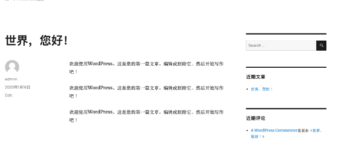


## Ceph¶

> Ceph 是一个统一的分布式存储系统，提供较好的性能、可靠性和可扩展性。最早起源于 Sage 博士期间的工作，随后贡献给开源社区。

### 简介¶

> `高性能`

*   抛弃了传统的集中式存储运输局寻址的方案，采用 `CRUSH` 算法，数据分布均衡，并行度高。
*   考虑了容灾域的隔离，能够实现各类负载的副本设置规则，例如跨机房、机架感知等。
*   能够支持上千个存储节点的规模，支持 TB 到 PB 级的数据。

> `高可用性`

*   副本数可以灵活控制
*   支持故障域分离，数据强一致性
*   多种故障场景自动进行修复自愈
*   没有单点故障，自动管理

> `高可扩展性`

*   去中心化
*   扩展灵活
*   随着节点增加而线性增长

> `特性丰富`

*   支持三种存储接口：块存储、文件存储、对象存储
*   支持自定义接口，支持多种语言驱动

### 架构¶

> `支持三种接口`

*   Object：有原生 API，而且也兼容 Swift 和 S3 的 API
*   Block：支持精简配置、快照、克隆
*   File：Posix 接口，支持快照

> 

### 组件¶

> `Monitor`：一个 Ceph 集群需要多个 Monitor 组成的小集群，它们通过 Paxos 同步数据，用来保存 OSD 的元数据。

> `OSD`：全称 

```
Object Storage Device
```

，也就是负责响应客户端请求返回具体数据的进程，一个 Ceph 集群一般都有很多个 OSD。主要功能用于数据的存储，当直接使用硬盘作为存储目标时，一块硬盘称之为 `OSD`，当使用一个目录作为存储目标的时候，这个目录也被称为 `OSD`。

> `MDS`：全称 `Ceph Metadata Server`，是 CephFS 服务依赖的元数据服务，对象存储和块设备存储不需要该服务。

> `Object`：Ceph 最底层的存储单元是 Object 对象，一条数据、一个配置都是一个对象，每个 Object 包含 ID、元数据和原始数据。

> `Pool`：Pool 是一个存储对象的逻辑分区，它通常规定了数据冗余的类型与副本数，默认为3副本。对于不同类型的存储，需要单独的 Pool，如 RBD。

> `PG`：全称 `Placement Grouops`，是一个逻辑概念，一个 OSD 包含多个 PG。引入 PG 这一层其实是为了更好的分配数据和定位数据。每个 `Pool` 内包含很多个 PG，它是一个对象的集合，服务端数据均衡和恢复的最小单位就是 PG。

> 

*   pool 是 ceph 存储数据时的逻辑分区，它起到 namespace 的作用
*   每个 pool 包含一定数量(可配置)的 PG
*   PG 里的对象被映射到不同的 Object 上
*   pool 是分布到整个集群的

> `FileStore与BlueStore`：FileStore 是老版本默认使用的后端存储引擎，如果使用 FileStore，建议使用 `xfs` 文件系统。BlueStore 是一个新的后端存储引擎，可以直接管理裸硬盘，抛弃了 ext4 与 xfs 等本地文件系统。可以直接对物理硬盘进行操作，同时效率也高出很多。

> `RADOS`：全称 

```
Reliable Autonomic Distributed Object Store
```

，是 Ceph 集群的精华，用于实现数据分配、Failover 等集群操作。

> `Librados`：`Librados` 是 Rados 提供库，因为 RADOS 是协议很难直接访问，因此上层的 RBD、RGW 和 CephFS 都是通过 librados 访问的，目前提供 PHP、Ruby、Java、Python、C 和 C++ 支持。

> `CRUSH`：`CRUSH` 是 Ceph 使用的数据分布算法，类似一致性哈希，让数据分配到预期的地方。

> `RBD`：全称 `RADOS Block Device`，是 Ceph 对外提供的块设备服务，如虚拟机硬盘，支持快照功能。

> `RGW`：全称是 `RADOS Gateway`，是 Ceph 对外提供的对象存储服务，接口与 S3 和 Swift 兼容。

> `CephFS`：全称 `Ceph File System`，是 Ceph 对外提供的文件系统服务。

### 块存储¶

> `典型设备`

> 磁盘阵列，硬盘，主要是将裸磁盘空间映射给主机使用的。

> `优点`

*   通过 Raid 与 LVM 等手段，对数据提供了保护。
*   多块廉价的硬盘组合起来，提高容量。
*   多块磁盘组合出来的逻辑盘，提升读写效率。

> `缺点`

*   采用 SAN 架构组网时，光纤交换机，造价成本高。
*   主机之间无法共享数据。

> `使用场景`

*   Docker 容器、虚拟机磁盘存储分配。
*   日志存储
*   文件存储
*   ...

### 文件存储¶

> `典型设备` FTP、NFS 服务器，为了克服块存储文件无法共享的问题，所以有了文件存储，在服务器上架设 FTP 与 NFS 服务器，就是文件存储。

> `优点`

*   造价低，随便一台机器就可以了
*   方便文件可以共享

> `缺点`

*   读写速率低
*   传输速率慢

> `使用场景`

*   日志存储
*   有目录结构的文件存储
*   ...

### 对象存储¶

> `典型设备`

> 内置大容量硬盘的分布式服务器(swift, s3)；多台服务器内置大容量硬盘，安装上对象存储管理软件，对外提供读写访问功能。

> `优点`

*   具备块存储的读写高速。
*   具备文件存储的共享等特性

> `使用场景`：(适合更新变动较少的数据)

*   图片存储
*   视频存储
*   ...

### 部署¶

> 由于我们这里在 Kubernetes 集群中使用，也为了方便管理，我们这里使用 Rook 来部署 Ceph 集群，Rook 是一个开源的云原生存储编排工具，提供平台、框架和对各种存储解决方案的支持，以和云原生环境进行本地集成。

> Rook 将存储软件转变成自我管理、自我扩展和自我修复的存储服务，通过自动化部署、启动、配置、供应、扩展、升级、迁移、灾难恢复、监控和资源管理来实现。Rook 底层使用云原生容器管理、调度和编排平台提供的能力来提供这些功能，其实就是我们平常说的 Operator。Rook 利用扩展功能将其深度集成到云原生环境中，并为调度、生命周期管理、资源管理、安全性、监控等提供了无缝的体验。有关 Rook 当前支持的存储解决方案的状态的更多详细信息，可以参考 Rook 仓库 的项目介绍。

> 

> Rook 包含多个组件：

*   Rook Operator：Rook 的核心组件，Rook Operator 是一个简单的容器，自动启动存储集群，并监控存储守护进程，来确保存储集群的健康。
*   Rook Agent：在每个存储节点上运行，并配置一个 FlexVolume 或者 CSI 插件，和 Kubernetes 的存储卷控制框架进行集成。Agent 处理所有的存储操作，例如挂接网络存储设备、在主机上加载存储卷以及格式化文件系统等。
*   Rook Discovers：检测挂接到存储节点上的存储设备。

> Rook 还会用 Kubernetes Pod 的形式，部署 Ceph 的 MON、OSD 以及 MGR 守护进程。Rook Operator 让用户可以通过 CRD 来创建和管理存储集群。每种资源都定义了自己的 CRD：

*   RookCluster：提供了对存储机群的配置能力，用来提供块存储、对象存储以及共享文件系统。每个集群都有多个 Pool。
*   Pool：为块存储提供支持，Pool 也是给文件和对象存储提供内部支持。
*   Object Store：用 S3 兼容接口开放存储服务。
*   File System：为多个 Kubernetes Pod 提供共享存储。

### 环境¶

> Rook Ceph 需要使用 RBD 内核模块，我们可以通过运行 `modprobe rbd` 来测试 Kubernetes 节点是否有该模块，如果没有，则需要更新下内核版本。

> 另外需要在节点上安装 `lvm2` 软件包：

```
# Centos
sudo yum install -y lvm2
# Ubuntu
sudo apt-get install -y lvm2
```

### 安装¶

> 我们这里部署最新的 release-1.2 版本的 Rook，部署清单文件地址：https://github.com/rook/rook/tree/release-1.2/cluster/examples/kubernetes/ceph。

> 从上面链接中下载 common.yaml 与 operator.yaml 两个资源清单文件：

```
# 会安装crd、rbac相关资源对象
$ kubectl apply -f common.yaml
# 安装 rook operator
$ kubectl apply -f operator.yaml
```

> 在继续操作之前，验证 `rook-ceph-operator` 是否处于`Running`状态：

```
$ kubectl get pods -n rook-ceph
NAME                                  READY   STATUS    RESTARTS   AGE
rook-ceph-operator-6d8fb9498b-jxdwx   1/1     Running   0          34s
rook-discover-7wpsl                   1/1     Running   0          32s
rook-discover-8t8lv                   1/1     Running   0          32s
rook-discover-9t497                   1/1     Running   0          32s
rook-discover-v57rd                   1/1     Running   0          32s
```

> 我们可以看到 Operator 运行成功后，还会有一个 DaemonSet 控制器运行得 rook-discover 应用，当 `Rook Operator` 处于 Running 状态，我们就可以创建 Ceph 集群了。为了使集群在重启后不受影响，请确保设置的 `dataDirHostPath` 属性值为有效得主机路径。更多相关设置，可以查看集群配置相关文档。

> 创建如下的资源清单文件：(cluster.yaml)

```
apiVersion: ceph.rook.io/v1
kind: CephCluster
metadata:
  name: rook-ceph
  namespace: rook-ceph
spec:
  cephVersion:
    # 最新得 ceph 镜像, 可以查看 https://hub.docker.com/r/ceph/ceph/tags
    image: ceph/ceph:v5
  dataDirHostPath: /var/lib/rook  # 主机有效目录
  mon:
    count: 3
  dashboard:
    enabled: true
  storage:
    useAllNodes: true
    useAllDevices: false
    # 重要: Directories 应该只在预生产环境中使用
    directories:
    - path: /data/rook
```

> 其中有几个比较重要的字段：

*   `dataDirHostPath`：宿主机上的目录，用于每个服务存储配置和数据。如果目录不存在，会自动创建该目录。由于此目录在主机上保留，因此在删除 Pod 后将保留该目录，另外不得使用以下路径及其任何子路径：`/etc/ceph`、`/rook` 或 `/var/log/ceph`。
*   `useAllNodes`：用于表示是否使用集群中的所有节点进行存储，如果在 `nodes` 字段下指定了各个节点，则必须将`useAllNodes`设置为 false。
*   `useAllDevices`：表示 OSD 是否自动使用节点上的所有设备，一般设置为 false，这样可控性较高
*   `directories`：一般来说应该使用一块裸盘来做存储，有时为了测试方便，使用一个目录也是可以的，当然生成环境不推荐使用目录。

> 除了上面这些字段属性之外还有很多其他可以细粒度控制得参数，可以查看集群配置相关文档。

> 现在直接创建上面的 `CephCluster` 对象即可：

```
$ kubectl apply -f cluster.yaml 
cephcluster.ceph.rook.io/rook-ceph created
```

> 创建完成后，Rook Operator 就会根据我们的描述信息去自动创建 Ceph 集群了。

### 验证¶

> 要验证集群是否处于正常状态，我们可以使用 Rook 工具箱 来运行 `ceph status` 命令查看。

> Rook 工具箱是一个用于调试和测试 Rook 的常用工具容器，该工具基于 CentOS 镜像，所以可以使用 yum 来轻松安装更多的工具包。我们这里用 Deployment 控制器来部署 Rook 工具箱，部署的资源清单文件如下所示：（toolbox.yaml）

```
apiVersion: apps/v1
kind: Deployment
metadata:
  name: rook-ceph-tools
  namespace: rook-ceph
  labels:
    app: rook-ceph-tools
spec:
  replicas: 1
  selector:
    matchLabels:
      app: rook-ceph-tools
  template:
    metadata:
      labels:
        app: rook-ceph-tools
    spec:
      dnsPolicy: ClusterFirstWithHostNet
      containers:
      - name: rook-ceph-tools
        image: rook/ceph:v1
        command: ["/tini"]
        args: ["-g", "--", "/usr/local/bin/toolbox.sh"]
        imagePullPolicy: IfNotPresent
        env:
          - name: ROOK_ADMIN_SECRET
            valueFrom:
              secretKeyRef:
                name: rook-ceph-mon
                key: admin-secret
        securityContext:
          privileged: true
        volumeMounts:
          - mountPath: /dev
            name: dev
          - mountPath: /sys/bus
            name: sysbus
          - mountPath: /lib/modules
            name: libmodules
          - name: mon-endpoint-volume
            mountPath: /etc/rook
      # 如果设置 hostNetwork: false,  "rbd map" 命令会被 hang 住, 参考 https://github.com/rook/rook/issues/2021
      hostNetwork: true
      volumes:
        - name: dev
          hostPath:
            path: /dev
        - name: sysbus
          hostPath:
            path: /sys/bus
        - name: libmodules
          hostPath:
            path: /lib/modules
        - name: mon-endpoint-volume
          configMap:
            name: rook-ceph-mon-endpoints
            items:
            - key: data
              path: mon-endpoints
```

> 然后直接创建这个 Pod：

```
$ kubectl apply -f toolbox.yaml
deployment.apps/rook-ceph-tools created
```

> 一旦 toolbox 的 Pod 运行成功后，我们就可以使用下面的命令进入到工具箱内部进行操作：

```
$ kubectl -n rook-ceph exec -it $(kubectl -n rook-ceph get pod -l "app=rook-ceph-tools" -o jsonpath='{.items[0].metadata.name}') bash
```

> 工具箱中的所有可用工具命令均已准备就绪，可满足您的故障排除需求。例如：

```
ceph status
ceph osd status
ceph df
rados df
```

> 比如现在我们要查看集群的状态，需要满足下面的条件才认为是健康的：

*   所有 mons 应该达到法定数量
*   mgr 应该是激活状态
*   至少有一个 OSD 处于激活状态
*   如果不是 HEALTH_OK 状态，则应该查看告警或者错误信息

```
$ ceph status
ceph status
  cluster:
    id:     dae083e6-8487-447b-b6ae-9eb321818439
    health: HEALTH_OK

  services:
    mon: 3 daemons, quorum a,b,c (age 15m)
    mgr: a(active, since 2m)
    osd: 31 osds: 2 up (since 6m), 2 in (since 6m)

  data:
    pools:   0 pools, 0 pgs
    objects: 0 objects, 0 B
    usage:   79 GiB used, 314 GiB / 393 GiB avail
    pgs:
```

> 如果群集运行不正常，可以查看 Ceph 常见问题以了解更多详细信息和可能的解决方案。

### Dashboard¶

> Ceph 有一个 Dashboard 工具，我们可以在上面查看集群的状态，包括总体运行状态，mgr、osd 和其他 Ceph 进程的状态，查看池和 PG 状态，以及显示守护进程的日志等等。

> 我们可以在上面的 cluster CRD 对象中开启 dashboard，设置

```
dashboard.enable=true
```

即可，这样 Rook Operator 就会启用 ceph-mgr dashboard 模块，并将创建一个 Kubernetes Service 来暴露该服务，将启用端口 7000 进行 https 访问，如果 Ceph 集群部署成功了，我们可以使用下面的命令来查看 Dashboard 的 Service：

```
$ kubectl get svc -n rook-ceph
NAME                         TYPE        CLUSTER-IP       EXTERNAL-IP   PORT(S)          AGE
rook-ceph-mgr              ClusterIP   1       <none>        9283/TCP            3m6s
rook-ceph-mgr-dashboard    ClusterIP   11180   <none>        7000/TCP            3m29s
```

> 这里的 rook-ceph-mgr 服务用于报告 Prometheus metrics 指标数据的，而后面的的 rook-ceph-mgr-dashboard 服务就是我们的 Dashboard 服务，如果在集群内部我们可以通过 DNS 名称 

```
http://rook-ceph-mgr-dashboard.rook-ceph:7000
```

或者 CluterIP 

```
http://11180:7000
```

 来进行访问，但是如果要在集群外部进行访问的话，我们就需要通过 Ingress 或者 NodePort 类型的 Service 来暴露了，为了方便测试我们这里创建一个新的 NodePort 类型的服务来访问 Dashboard，资源清单如下所示：（dashboard-external.yaml）

```
apiVersion: v1
kind: Service
metadata:
  name: rook-ceph-mgr-dashboard-external
  namespace: rook-ceph
  labels:
    app: rook-ceph-mgr
    rook_cluster: rook-ceph
spec:
  ports:
  - name: dashboard
    port: 7000
    protocol: TCP
    targetPort: 7000
  selector:
    app: rook-ceph-mgr
    rook_cluster: rook-ceph
  type: NodePort
```

> 同样直接创建即可：

```
$ kubectl apply -f dashboard-external.yaml
```

> 创建完成后我们可以查看到新创建的 rook-ceph-mgr-dashboard-external 这个 Service 服务：

```
$ kubectl get svc -n rook-ceph 
NAME                                    TYPE        CLUSTER-IP       EXTERNAL-IP   PORT(S)          AGE
rook-ceph-mgr                           ClusterIP   29     <none>        9283/TCP            23m
rook-ceph-mgr-dashboard                 ClusterIP   198     <none>        7000/TCP            23m
rook-ceph-mgr-dashboard-external   NodePort    1223    <none>        7000:31361/TCP      14s
```

> 现在我们需要通过 

```
http://<NodeIp>:31361
```

 就可以访问到 Dashboard 了。

> 

> 但是在访问的时候需要我们登录才能够访问，Rook 创建了一个默认的用户 admin，并在运行 Rook 的命名空间中生成了一个名为 

```
rook-ceph-dashboard-admin-password
```

 的 Secret，要获取密码，可以运行以下命令：

```
$ kubectl -n rook-ceph get secret rook-ceph-dashboard-password -o jsonpath="{['data']['password']}" | base64 --decode && echo
xxxx（登录密码）
```

> 用上面获得的密码和用户名 admin 就可以登录 Dashboard 了，在 Dashboard 上面可以查看到整个集群的状态：

> 

### 使用¶

> 现在我们的 Ceph 集群搭建成功了，我们就可以来使用存储了。首先我们需要创建存储池，可以用 CRD 来定义 Pool。Rook 提供了两种机制来维持 OSD：

*   副本：缺省选项，每个对象都会根据 `spec.replicated.size` 在多个磁盘上进行复制。建议非生产环境至少 2 个副本，生产环境至少 3 个。
*   Erasure Code：是一种较为节约的方式。EC 把数据拆分 n 段（

    ```
    spec.erasureCoded.dataChunks
    ```

    ），再加入 k 个代码段（

    ```
    spec.erasureCoded.codingChunks
    ```

    ），用分布的方式把 `n+k` 段数据保存在磁盘上。这种情况下 Ceph 能够隔离 k 个 OSD 的损失。

> 我们这里使用副本的方式，创建如下所示的 RBD 类型的存储池：(pool.yaml)

```
apiVersion: ceph.rook.io/v1
kind: CephBlockPool
metadata:
  name: k8s-test-pool   # operator会监听并创建一个pool，执行完后界面上也能看到对应的pool
  namespace: rook-ceph
spec:
  failureDomain: host  # 数据块的故障域: 值为host时，每个数据块将放置在不同的主机上;值为osd时，每个数据块将放置在不同的osd上
  replicated:
    size: 3   # 池中数据的副本数,1就是不保存任何副本
```

> 直接创建上面的资源对象：

```
$ kubectl apply -f pool.yaml 
cephblockpool.ceph.rook.io/k8s-test-pool created
```

> 存储池创建完成后我们在 Dashboard 上面的确可以看到新增了一个 pool，但是会发现集群健康状态变成了 `WARN`，我们可以查看到有如下日志出现：

```
Health check update: too few PGs per OSD (6 < min 30) (TOO_FEW_PGS)
```

> 这是因为每个 osd 上的 pg 数量小于最小的数目30个。pgs 为8，因为是3副本的配置，所以当有4个 osd 的时候，每个 osd 上均分了8/4 *3=6个pgs，也就是出现了如上的错误小于最小配置30个，集群这种状态如果进行数据的存储和操作，集群会卡死，无法响应io，同时会导致大面积的 osd down。

> 我们可以进入 toolbox 的容器中查看上面存储的 pg 数量：

```
$ ceph osd pool get k8s-test-pool pg_num
pg_num: 8
```

> 我们可以通过增加 pg_num 来解决这个问题：

```
$ ceph osd pool set k8s-test-pool pg_num 64
set pool 1 pg_num to 64
$ ceph -s
  cluster:
    id:     7851387c-5d18-489a-8c04-b699fb9764c0
    health: HEALTH_OK

  services:
    mon: 3 daemons, quorum a,b,c (age 33m)
    mgr: a(active, since 32m)
    osd: 4 osds: 4 up (since 32m), 4 in (since 32m)

  data:
    pools:   1 pools, 64 pgs
    objects: 0 objects, 0 B
    usage:   182 GiB used, 605 GiB / 787 GiB avail
    pgs:     64 active+clean
```

> 这个时候我们再查看就可以看到现在就是健康状态了。不过需要注意的是我们这里的 pool 上没有数据，所以修改 pg 影响并不大，但是如果是生产环境重新修改 pg 数，会对生产环境产生较大影响。因为 pg 数变了，就会导致整个集群的数据重新均衡和迁移，数据越大响应 io 的时间会越长。所以，最好在一开始就设置好 pg 数。

> 现在我们来创建一个 StorageClass 来进行动态存储配置，如下所示我们定义一个 Ceph 的块存储的 StorageClass：(storageclass.yaml)

```
apiVersion: storage.k8s.io/v1
kind: StorageClass
metadata:
  name: rook-ceph-block
provisioner: rook-ceph.rbd.csi.ceph.com
parameters:
  # clusterID 是 rook 集群运行的命名空间
  clusterID: rook-ceph

  # 指定存储池
  pool: k8s-test-pool

  # RBD image (实际的存储介质) 格式. 默认为 "2".
  imageFormat: "2"

  # RBD image 特性. CSI RBD 现在只支持 `layering` .
  imageFeatures: layering

  # Ceph 管理员认证信息，这些都是在 clusterID 命名空间下面自动生成的
  csi.storage.k8s.io/provisioner-secret-name: rook-csi-rbd-provisioner
  csi.storage.k8s.io/provisioner-secret-namespace: rook-ceph
  csi.storage.k8s.io/node-stage-secret-name: rook-csi-rbd-node
  csi.storage.k8s.io/node-stage-secret-namespace: rook-ceph
  # 指定 volume 的文件系统格式，如果不指定, csi-provisioner 会默认设置为 `ext4`
  csi.storage.k8s.io/fstype: ext4
# uncomment the following to use rbd-nbd as mounter on supported nodes
# **IMPORTANT**: If you are using rbd-nbd as the mounter, during upgrade you will be hit a ceph-csi
# issue that causes the mount to be disconnected. You will need to follow special upgrade steps
# to restart your application pods. Therefore, this option is not recommended.
#mounter: rbd-nbd
reclaimPolicy: Delete
```

> 直接创建上面的 StorageClass 资源对象：

```
$ kubectl apply -f storageclass.yaml 
storageclass.storage.k8s.io/rook-ceph-block created
$ kubectl get storageclass
NAME              PROVISIONER                    AGE
rook-ceph-block   rook-ceph.rbd.csi.ceph.com     35s
```

> 然后创建一个 PVC 来使用上面的 StorageClass 对象：(pvc.yaml)

```
apiVersion: v1
kind: PersistentVolumeClaim
metadata:
  name: mysql-pv-claim
  labels:
    app: wordpress
spec:
  storageClassName: rook-ceph-block
  accessModes:
  - ReadWriteOnce
  resources:
    requests:
      storage: 20Gi
```

> 同样直接创建上面的 PVC 资源对象：

```
$ kubectl apply -f pvc.yaml 
persistentvolumeclaim/mysql-pv-claim created
$ kubectl get pvc -l app=wordpress
NAME             STATUS   VOLUME                                     CAPACITY   ACCESS MODES   STORAGECLASS      AGE
mysql-pv-claim   Bound    pvc-1eab82e3-d214-4d8e-8fcc-ed379c24e0e3   20Gi       RWO            rook-ceph-block   32m
```

> 创建完成后我们可以看到我们的 PVC 对象已经是 Bound 状态了，自动创建了对应的 PV，然后我们就可以直接使用这个 PVC 对象来做数据持久化操作了。

> 这个时候可能集群还会出现如下的健康提示：

```
$ ceph health detail
HEALTH_WARN application not enabled on 1 pool(s)
POOL_APP_NOT_ENABLED application not enabled on 1 pool(s)
    application not enabled on pool 'k8s-test-pool'
    use 'ceph osd pool application enable <pool-name> <app-name>', where <app-name> is 'cephfs', 'rbd', 'rgw', or freeform for custom applications.
$ ceph osd pool application enable k8s-test-pool k8srbd
enabled application 'k8srbd' on pool 'k8s-test-pool'
```

> 根据提示启用一个 application 即可。

> 在官方仓库 cluster/examples/kubernetes 目录下，官方给了个 wordpress 的例子，可以直接运行测试即可：

```
$ kubectl apply -f mysql.yaml
$ kubectl apply -f wordpress.yaml
```

> 官方的这个示例里面的 wordpress 用的 Loadbalancer 类型，我们可以改成 NodePort：

```
$ kubectl get pvc -l app=wordpress
NAME             STATUS   VOLUME                                     CAPACITY   ACCESS MODES   STORAGECLASS      AGE
mysql-pv-claim   Bound    pvc-1eab82e3-d214-4d8e-8fcc-ed379c24e0e3   20Gi       RWO            rook-ceph-block   12h
wp-pv-claim      Bound    pvc-237932ed-5ca7-468c-bd16-220ebb2a1ce3   20Gi       RWO            rook-ceph-block   25s
$ kubectl get pods -l app=wordpress               
NAME                              READY   STATUS    RESTARTS   AGE
wordpress-5b886cf59b-4xwn8        1/1     Running   0          24m
wordpress-mysql-b9ddd6d4c-qhjd4   1/1     Running   0          24m
$ kubectl get svc -l app=wordpress
NAME              TYPE        CLUSTER-IP       EXTERNAL-IP   PORT(S)        AGE
wordpress         NodePort    12225   <none>        80:30307/TCP   80s
wordpress-mysql   ClusterIP   None             <none>        3306/TCP       87s
```

> 当应用都处于 Running 状态后，我们可以通过 

```
http://<任意节点IP>:30307
```

 去访问 wordpress 应用：

> 

> 比如我们在第一篇文章中更改下内容，然后我们将应用 Pod 全部删除重建：

```
$ kubectl delete pod wordpress-mysql-b9ddd6d4c-qhjd4 wordpress-5b886cf59b-4xwn8
pod "wordpress-mysql-b9ddd6d4c-qhjd4" deleted
pod "wordpress-5b886cf59b-4xwn8" deleted
$ kubectl get pods -l app=wordpress                                            
NAME                              READY   STATUS    RESTARTS   AGE
wordpress-5b886cf59b-kwxk4        1/1     Running   0          2m52s
wordpress-mysql-b9ddd6d4c-kkcr7   1/1     Running   0          2m52s
```

> 当 Pod 重建完成后再次访问 wordpress 应用的主页我们可以发现之前我们添加的数据仍然存在，这就证明我们的数据持久化是正确的。