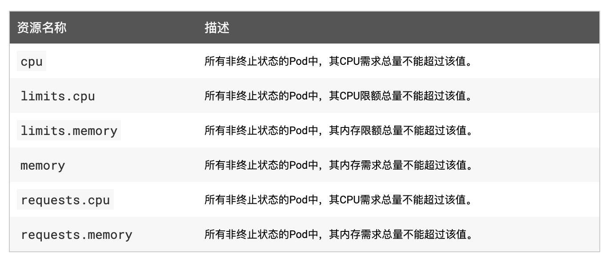
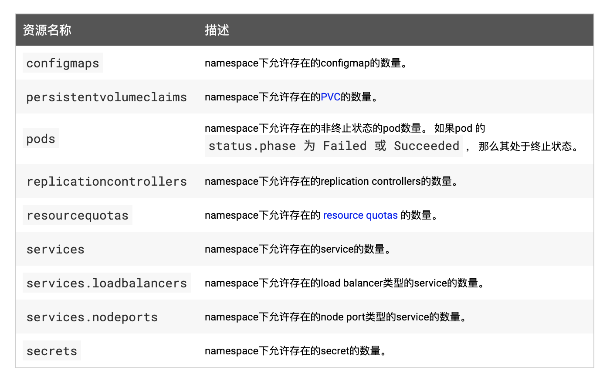

## 资源配额

> 资源配额用于管理命名空间中对象使用的资源量，我们可以按 CPU 和内存用量或对象数量来设置配额。通过资源配额，可以确保租户不会使用超过其分配份额的集群资源。

> 资源配额是通过 `ResourceQuota` 资源对象来定义的，可以对每个 namespace 的资源消耗总量提供限制。它可以按类型限制 namespace 下可以创建的对象的数量，也可以限制可被该项目以资源形式消耗的计算资源的总量。

> 资源配额的工作方式如下：

*   管理员为每个 namespace 创建一个或多个资源配额对象
*   用户在 namespace 下创建资源 (pods、 services 等)，同时配额系统会跟踪使用情况，来确保其不超过资源配额中定义的硬性资源限额
*   如果资源的创建或更新违反了配额约束，则请求会失败，并返回 HTTP 状态码 `403 FORBIDDEN`，以及说明违反配额约束的信息
*   如果 namespace 下的计算资源（如 cpu 和 memory）的配额被启用，则用户必须为这些资源设定请求值（request） 和约束值（limit），否则配额系统将拒绝 Pod 的创建。

> 提示

> 可使用 `LimitRange` 准入控制器来为没有设置计算资源需求的Pod设置默认值。

> Kubernetes 中主要有3个层级的资源配额控制：

*   容器：可以对 CPU 和 Memory 进行限制
*   POD：可以对一个 Pod 内所有容器的的资源进行限制
*   Namespace：为一个命名空间下的资源进行限制

> 其中容器层次主要利用容器本身的支持，比如 Docker 对 CPU、内存等的支持；Pod 方面可以限制系统内创建 Pod 的资源范围，比如最大或者最小的 CPU、memory 需求；Namespace 层次就是对用户级别的资源限额了，包括 CPU、内存，还可以限定 Pod、RC、Service 的数量。

> 要使用资源配额的话需要确保 `apiserver`的 

```
--enable-admission-plugins=
```

 参数中包含 `ResourceQuota`，当 namespace 中存在一个 `ResourceQuota` 对象时，该 namespace 即开始实施资源配额的管理工作了，另外需要注意的是一个 namespace 中最多只应存在一个 `ResourceQuota` 对象。

> 资源配额控制器支持的配额控制资源主要包括：计算资源配额、存储资源配额、对象数量资源配额以及配额作用域，下面我们来分别看看这些资源的具体信息：

### 计算资源配额

> 用户可以对给定 namespace 下的计算资源总量进行限制，支持的资源类型如下所示：

> 

> 比如我们现在来为一个命名空间创建内存和 CPU 配额，首先创建一个测试用的命名空间：

```
$ kubectl create namespace quota-mem-cpu-example
```

> 然后定义一个如下所示的资源配额资源对象：（quota-mem-cpu.yaml）

```
apiVersion: v1
kind: ResourceQuota
metadata:
  name: mem-cpu-demo
  namespace: quota-mem-cpu-example
spec:
  hard:
    requests.cpu: "1"
    requests.memory: 1Gi
    limits.cpu: "2"
    limits.memory: 2Gi
```

> 直接创建这个资源对象：

```
$ kubectl apply -f quota-mem-cpu.yaml
resourcequota/mem-cpu-demo created
```

> 然后我们查看下上面我们创建的 `ResourceQuota` 对象：

```
$ kubectl describe quota mem-cpu-demo -n quota-mem-cpu-example
Name:            mem-cpu-demo
Namespace:       quota-mem-cpu-example
Resource         Used  Hard
--------         ----  ----
limits.cpu       0     2
limits.memory    0     2Gi
requests.cpu     0     1
requests.memory  0     1Gi
```

> 比如现在我们来创建一个如下所示的 Pod：

```
apiVersion: v1
kind: Pod
metadata:
  name: quota-mem-cpu-demo
  namespace: quota-mem-cpu-example
spec:
  containers:
  - name: quota-mem-cpu-demo-ctr
    image: nginx
    resources:
      limits:
        memory: "800Mi"
        cpu: "800m" 
      requests:
        memory: "600Mi"
        cpu: "400m"
```

> 直接创建这个 Pod：

```
$ kubectl apply -f quota-mem-cpu-pod.yaml
$ kubectl get pods -n quota-mem-cpu-example
NAME                 READY   STATUS    RESTARTS   AGE
quota-mem-cpu-demo   1/1     Running   0          32s
```

> 可以看到这个 Pod 已经正常运行起来了，这个时候我们再看一次上面我们定义的资源配额对象：

```
$ kubectl describe quota mem-cpu-demo -n quota-mem-cpu-example
Name:            mem-cpu-demo
Namespace:       quota-mem-cpu-example
Resource         Used   Hard
--------         ----   ----
limits.cpu       800m   2
limits.memory    800Mi  2Gi
requests.cpu     400m   1
requests.memory  600Mi  1Gi
```

> 我们可以看到已经明确告诉我们已经使用了多少计算资源了，比如内存的请求值只剩 400Mi（1Gi-600Mi）资源了，我们现在来创建一个大于 400Mi 请求内存的资源测试下：(quota-mem-cpu-pod-2.yaml)

```
apiVersion: v1
kind: Pod
metadata:
  name: quota-mem-cpu-demo-2
  namespace: quota-mem-cpu-example
spec:
  containers:
  - name: quota-mem-cpu-demo-2-ctr
    image: redis
    resources:
      limits:
        memory: "1Gi"
        cpu: "800m"      
      requests:
        memory: "700Mi"
        cpu: "400m"
```

> 这个时候我们来创建这个资源对象：

```
$ kubectl apply -f quota-mem-cpu-pod-yaml 
Error from server (Forbidden): error when creating "quota-mem-cpu-pod-yaml": pods "quota-mem-cpu-demo-2" is forbidden: exceeded quota: mem-cpu-demo, requested: requests.memory=700Mi, used: requests.memory=600Mi, limited: requests.memory=1Gi
```

> 可以看到已经被拒绝了，因为 `requests.memory` 已经超过了我们的资源配额的限制了。

> 从上面的练习来看我们可以使用 `ResourceQuota` 来限制命名空间中运行的所有容器的 CPU 和 内存的资源配额总数，如果限制单个容器而不是所有容器的总数，就需要使用 `LimitRange` 资源对象了。另外如果在一个命名空间下面计算资源（如 CPU 和内存）的配额被启用了，则用户必须为这些资源设置请求值（request）和约束值（limit），否则配额系统将拒绝 Pod 的创建，除非我们配置了 `LimitRange` 资源对象。

> 要使用 `LimitRange` 同样需要在 

```
--enable-admission-plugins=
```

 参数中开启 `LimitRanger`。比如现在我们来配置一个命名空间中容器的最小和最大的内存限制，我们创建一个命名空间来进行配置：

```
$ kubectl create namespace constraints-mem-example
```

> 然后创建一个 LimitRange 的配置资源文件：(memory-constraints.yaml)

```
apiVersion: v1
kind: LimitRange
metadata:
  name: mem-min-max-demo-lr
  namespace: constraints-mem-example
spec:
  limits:
  - max:
      memory: 1Gi
    min:
      memory: 500Mi
    type: Container
```

> 创建这个资源对象：

```
$ kubectl apply -f memory-constraints.yaml
```

> 然后我们可以查看 LimitRange 的详细信息：

```
$ kubectl get limitrange mem-min-max-demo-lr --namespace=constraints-mem-example --output=yaml
......
  limits:
  - default:
      memory: 1Gi
    defaultRequest:
      memory: 1Gi
    max:
      memory: 1Gi
    min:
      memory: 500Mi
    type: Container
```

> 上面输出显示了最小和最大的内存约束，但是要注意即使我们没有指定默认值，他们也会自动创建的。现在，只要在 

```
constraints-mem-example
```

 命名空间中创建容器，Kubernetes 就会执行下面的步骤：

*   如果 Container 未指定自己的内存请求和限制，将为它指定默认的内存请求和限制
*   验证 Container 的内存请求是否大于或等于 500 MiB
*   验证 Container 的内存限制是否小于或等于1 GiB

> 下面我们这里来创建一个 Pod，其中容器声明了 600 MiB 的内存请求和 800 MiB 的内存限制，这些满足了 LimitRange 的最小和最大内存约束：(memory-constraints-pod.yaml)

```
apiVersion: v1
kind: Pod
metadata:
  name: constraints-mem-demo
  namespace: constraints-mem-example
spec:
  containers:
  - name: constraints-mem-demo-ctr
    image: nginx
    resources:
      limits:
        memory: "800Mi"
      requests:
        memory: "600Mi"
```

> 然后直接创建即可：

```
$ kubectl create -f memory-constraints-pod.yaml 
$ kubectl get pods -n constraints-mem-example
NAME                   READY   STATUS    RESTARTS   AGE
constraints-mem-demo   1/1     Running   0          2m5s
```

> 我们可以看到是可以正常运行的。

> 然后我们再创建一个超过最大内存限制的 Pod 测试下：(memory-constraints-pod2.yaml)

```
apiVersion: v1
kind: Pod
metadata:
  name: constraints-mem-demo-2
  namespace: constraints-mem-example
spec:
  containers:
  - name: constraints-mem-demo-2-ctr
    image: nginx
    resources:
      limits:
        memory: "5Gi"
      requests:
        memory: "800Mi"
```

> 现在我们来创建下这个资源对象：

```
$ kubectl apply -f memory-constraints-podyaml 
Error from server (Forbidden): error when creating "memory-constraints-podyaml": pods "constraints-mem-demo-2" is forbidden: maximum memory usage per Container is 1Gi, but limit is 1536Mi
```

> 输出结果显示 Pod 没有创建成功，因为容器声明的内存限制太大了。我们也可以去尝试下创建一个小于最小内存限制的 Pod 或没有声明内存请求和限制的 Pod。

### 存储资源配额

> 用户可以对给定 namespace 下的存储资源总量进行限制，此外，还可以根据相关的存储类（Storage Class）来限制存储资源的消耗。

> 

### 对象数量配额

> 给定类型的对象数量可以被限制。 支持以下类型：

> 

### Qos 服务质量

> https://kubernetes.io/docs/tasks/configure-pod-container/quality-service-pod/