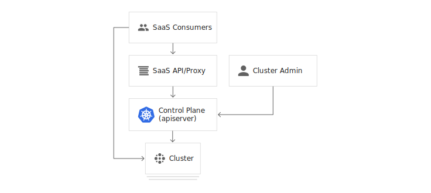

## 多租户

> 多租户集群由多个用户和/或工作负载共享，这些用户和/或工作负载被称为租户。多租户集群的运营方必须将租户彼此隔离，以最大限度地减少被盗用的租户或恶意租户可能对集群和其他租户造成的损害。此外，必须在租户之间公平地分配集群资源。

> 在规划多租户架构时，您应该考虑 Kubernetes 中的资源隔离层：集群、命名空间、节点、Pod 和容器。您还应该考虑在租户之间共享不同类型资源的安全隐患。例如，将来自不同租户的 Pod 调度到同一节点上可以减少集群中所需的机器数量。另一方面，您可能需要阻止某些工作负载共置。例如，您可能不允许来自组织外部的不受信任的代码与处理敏感信息的容器在同一节点上运行。

> 虽然 Kubernetes 不能保证租户之间完全安全地隔离，但它为特定使用场景提供了足够的相关功能。您可以将每个租户及其 Kubernetes 资源分隔到各自的命名空间中。然后，您可以使用一些限制策略来强制执行租户隔离。现在策略通常按命名空间划分，可用于限制 API 访问、资源使用以及允许容器执行的操作。

> 多租户集群的租户共享以下资源：

*   扩展程序、控制器、插件和自定义资源定义 (CRD)。
*   集群控制平面。这意味着集群操作、安全性和审核是集中管理的。

> 与运营多个单租户集群相比，运营多租户集群有几个优点：

*   减少管理开销
*   减少资源碎片
*   新租户无需等待集群创建

### 多租户使用用例

> 本部分介绍如何为各种多租户使用用例配置集群。

### 企业多租户

> 在企业环境中，集群的租户是组织内的不同团队。通常，每个租户对应一个命名空间，同一个命名空间内的网络流量不受限制，但不同命名空间之间的网络流量必须明确列入白名单。可以使用 Kubernetes 网络策略来实现这些隔离。

> 集群的用户根据其权限分为三种不同的角色：

*   集群管理员：此角色适用于在整个集群中管理所有租户的管理员。集群管理员可以创建、读取、更新和删除任何策略对象。他们可以创建命名空间并将其分配给命名空间管理员。
*   命名空间管理员：此角色适用于特定单一租户的管理员，命名空间管理员可以管理其命名空间中的用户。
*   开发者：此角色的成员可以创建、读取、更新和删除命名空间内的非策略对象，如 Pod、Job 和 Ingress。开发者只在他们有权访问的命名空间中拥有这些权限。

> 

### SaaS 提供商多租户

> SaaS 提供商集群的租户是应用的各个客户专用实例，以及 SaaS 的控制平面。要充分利用按命名空间划分的政策，应将各个应用实例安排到其各自的命名空间中，SaaS 控制平面的组件也应如此。最终用户无法直接与 Kubernetes 控制平面交互，而是使用 SaaS 的界面，由后者与 Kubernetes 控制平面进行交互。

> 例如，博客平台可以在多租户集群上运行，在这种情况下，租户是每个客户的博客实例和平台自己的控制平面。平台的控制平面和每个托管博客都将在不同的命名空间中运行。客户将通过平台的界面来创建和删除博客、更新博客软件版本，但无法了解集群的运作方式。

> 

### 多租户策略

> 在 Kubernetes 中提供了几项可用于管理多租户集群的功能。下面我们来分别介绍下这些功能。

### 命名空间

> Kubernetes 中的多租户都是根据 Namespace 来进行划分的，Namespace 是一组逻辑的集群，可以大概类似于租户的概念，可以做到一定程度的资源隔离、Quota。

> 如下面的两条命令：

```
$ kubectl –namespace=abc run nginx –image=nginx
$ kubectl run nginx –image=nginx
```

> 这两条命令虽然都是 run 起来一个 nginx，但是作用域却不一样。第一条命令是在一个叫 abc 的 namespace 里运行nginx，第二条命令则是在 Default 这个命名空间中。

### 访问权限控制

> 对于多租户来说，访问权限控制是非常重要的，我们可以使用 Kubernetes 内置的 RBAC 来进行权限控制，可以为集群中的特定资源和操作授予细化的权限。

> 对于 RBAC 的详细使用可以参考 RBAC 章节。

### 网络策略

> 通过集群网络策略，我们可以控制集群的 Pod 之间的通信，策略可以指定 Pod 可以与哪些命名空间、标签和 IP 地址范围进行通信。

> 对于网络策略的详细使用可以参考 网络策略 章节。

### 资源配额

> 资源配额用于管理命名空间中对象使用的资源量，我们可以按 CPU 和内存用量或对象数量来设置配额。通过资源配额，可以确保租户不会使用超过其分配份额的集群资源。

> 对于资源配额的使用可以参考 资源配额 章节

### Pod 安全策略

> `PodSecurityPolicies` 是一种 Kubernetes API 类型，用于验证创建和更新 Pod 的请求。PodSecurityPolicies 定义 Pod 规范中的安全敏感字段的默认值和要求。您可以创建策略来限制部署那些会访问主机文件系统、网络、PID 命名空间、卷等资源的 Pod。

> 了解 PSP 更多信息，查看 Pod 安全策略 章节

### Pod 反亲和性

> 注意：恶意租户可以规避 Pod 反亲和性规则。以下示例应仅用于具有受信任租户的集群，或租户无法直接访问 Kubernetes 控制平面的集群。 我们可以利用 Pod 反亲和性来防止不同租户的 Pod 被调度到同一节点上。例如，下面的 Pod 规范描述了一个标签为 `team: billing` 的 Pod，以及阻止该 Pod 与没有该标签的 Pod 调度到一起的反亲和性规则。

```
apiVersion: v1
kind: Pod
metadata:
  name: bar
  labels:
    team: "billing"
spec:
  affinity:
    podAntiAffinity:
      requiredDuringSchedulingIgnoredDuringExecution:  # 硬策略
      - topologyKey: "kubernetes.io/hostname"
        labelSelector:
          matchExpressions:
          - key: "team"
            operator: NotIn
            values: ["billing"]
```

> 上面这个资源清单的意思就是 `bar` 这个 Pod 不能调度到不具有 `team: billing` 这样的标签的 Pod 所在的节点，不过这种做法的缺点是恶意用户可以通过将 `team: billing` 标签添加到任意 Pod 来规避规则，仅使用 Pod 反亲和性机制不足以在具有不受信任的租户的集群上安全地强制执行政策。

### 污点和容忍

> 注意：恶意租户可以规避由节点污点和容忍机制强制执行的政策。以下示例应仅用于具有受信任租户的集群，或租户无法直接访问 Kubernetes 控制平面的集群。

> 节点污点是控制工作负载调度的另一种方法，您可以使用节点污点来将专用节点留给某些租户使用。例如，您可以将配备 GPU 的节点专门留给那些工作负载需要 GPU 的特定租户。要将某个节点池专门留给某个租户，请将具有 `effect: "NoSchedule"` 的污点应用于该节点池，然后，只有具备相应容忍设置的 Pod 可以被调度到该节点池中的节点。

> 这种做法的缺点是恶意用户可以通过为其 Pod 添加相应容忍设置来访问专用节点池，所以仅使用节点污点和容忍机制不足以在具有不受信任的租户的集群上安全地强制执行政策。

> 如果一个节点标记为污点（Taints），除非 Pod 也被标识为可以容忍污点节点，否则该 Taints 节点不会被调度 pod。

> 比如用户希望把 Master 节点保留给 Kubernetes 系统组件使用，或者把一组具有特殊资源预留给某些 Pod，则污点就很有用了，Pod 不会再被调度到 taint 标记过的节点。我们使用 kubeadm 搭建的集群默认就给 master 节点添加了一个污点标记，所以我们看到我们的普通 Pod 都没有被调度到 master 上去：

```
$ kubectl describe node master
Name:               master
Roles:              master
Labels:             beta.kubernetes.io/arch=amd64
                    beta.kubernetes.io/os=linux
                    kubernetes.io/hostname=master
                    node-role.kubernetes.io/master=
......
Taints:             node-role.kubernetes.io/master:NoSchedule
Unschedulable:      false
......
```

> 我们可以使用上面的命令查看 master 节点的信息，其中有一条关于 Taints 的信息：

```
node-role.kubernetes.io/master:NoSchedule
```

，就表示给 master 节点打了一个污点的标记，其中影响的参数是`NoSchedule`，表示 Pod 不会被调度到标记为 taints 的节点，除了 `NoSchedule` 外，还有另外两个选项：

*   `PreferNoSchedule`：NoSchedule 的软策略版本，表示尽量不调度到污点节点上去
*   `NoExecute`：该选项意味着一旦 Taint 生效，如该节点内正在运行的 Pod 没有对应 Tolerate 设置，会直接被逐出

> 污点 taint 标记节点的命令如下：

```
$ kubectl taint nodes node02 test=node02:NoSchedule
node "node02" tainted
```

> 上面的命名将 node02 节点标记为了污点，影响策略是 `NoSchedule`，只会影响新的 Pod 调度，如果仍然希望某个 Pod 调度到 taint 节点上，则必须在 Spec 中做出 `Toleration` 定义，才能调度到该节点，比如现在我们想要将一个 Pod 调度到 master 节点：(taint-demo.yaml)

```
apiVersion: apps/v1
kind: Deployment
metadata:
  name: taint
  labels:
    app: taint
spec:
  selector:
    matchLabels:
      app: taint
  replicas: 2
  template:
    metadata:
      labels:
        app: taint
    spec:
      containers:
      - name: nginx
        image: nginx:9
        ports:
        - name: http
          containerPort: 80
      tolerations:
      - key: "node-role.kubernetes.io/master"
        operator: "Exists"
        effect: "NoSchedule"
```

> 由于 master 节点被标记为了污点节点，所以我们这里要想 Pod 能够调度到 master 节点去，就需要增加容忍的声明：

```
tolerations:
- key: "node-role.kubernetes.io/master"
  operator: "Exists"
  effect: "NoSchedule"
```

> 然后创建上面的资源，查看结果：

```
$ kubectl create -f taint-demo.yaml
deployment.apps "taint" created
$ kubectl get pods -o wide
NAME                                      READY     STATUS             RESTARTS   AGE       IP             NODE
......
taint-845d8bb4fb-57mhm                    1/1       Running            0          1m        2247   node02
taint-845d8bb4fb-bbvmp                    1/1       Running            0          1m        233    master
taint-845d8bb4fb-zb78x                    1/1       Running            0          1m        2246   node02
......
```

> 我们可以看到有一个 Pod 副本被调度到了 master 节点，这就是容忍的使用方法。

> 对于 `tolerations` 属性的写法，其中的 key、value、effect 与节点的 Taint 设置需保持一致， 还有以下几点说明：

1.  如果 operator 的值是 `Exists`，则 value 属性可省略
2.  如果 operator 的值是 `Equal`，则表示其 key 与 value 之间的关系是 equal(等于)
3.  如果不指定 operator 属性，则默认值为 `Equal`

> 另外，还有两个特殊值：

1.  空的 key 如果再配合 Exists 就能匹配所有的 key 与 value，也就是能容忍所有节点的所有 Taints
2.  空的 effect 匹配所有的 effect

> 最后，如果我们要取消节点的污点标记，可以使用下面的命令：

```
$ kubectl taint nodes node02 test-
node "node02" untainted
```

### 参考资料

> Google Cloud Next 18 的 Kubernetes 多租户讲座